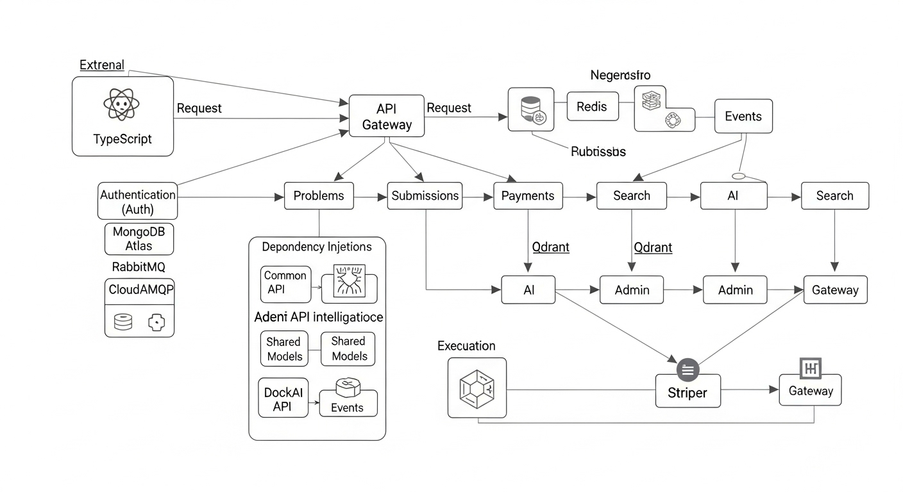

# DSAGrind Platform - Complete Architecture & Request Flow Documentation



## 📋 Table of Contents
1. [System Overview](#system-overview)
2. [Complete Request Flow](#complete-request-flow)
3. [Directory Structure Deep Dive](#directory-structure-deep-dive)
4. [Dependency Injection Architecture](#dependency-injection-architecture)
5. [Technology Integration Patterns](#technology-integration-patterns)
6. [Microservices Communication](#microservices-communication)
7. [Data Flow Patterns](#data-flow-patterns)
8. [File-by-File Breakdown](#file-by-file-breakdown)
9. [Event-Driven Architecture](#event-driven-architecture)
10. [Security & Authentication Flow](#security--authentication-flow)

---

## 🏗️ System Overview

DSAGrind is a **competitive programming platform** built with **event-driven microservices architecture** using **.NET 8 backend** and **React TypeScript frontend**. The system processes coding problems, executes user submissions in sandboxed environments, handles payments, and provides AI-powered assistance.

### Core Architecture Principles
- **API Gateway Pattern**: Single entry point via YARP reverse proxy
- **Event-Driven Communication**: RabbitMQ (CloudAMQP) for async messaging
- **Shared Kernel**: Common libraries for cross-cutting concerns
- **Domain-Driven Design**: Each microservice owns its domain
- **CQRS Pattern**: Separate read/write operations
- **Dependency Injection**: Constructor injection throughout

---

## 🔄 Complete Request Flow

### 1. Frontend Request Initiation
```
client/src/components/ → client/src/services/ → Gateway API (Port 5000)
```

**Example: User submits a coding solution**
```typescript
// client/src/services/SubmissionService.ts
const submitSolution = async (problemId: string, code: string) => {
  return axios.post('/api/submissions', { problemId, code, language: 'csharp' });
}
```

### 2. Gateway Processing
```
Gateway API → Authentication Middleware → YARP Proxy → Target Microservice
```

**File Flow:**
```
backend/src/Services/DSAGrind.Gateway.API/
├── Program.cs                 // Startup configuration
├── appsettings.json          // YARP routing rules
└── Properties/launchSettings.json // Development settings
```

**Gateway Route Configuration:**
```json
{
  "ReverseProxy": {
    "Routes": {
      "submissions-route": {
        "ClusterId": "submissions-cluster",
        "Match": {
          "Path": "/api/submissions/{**catch-all}"
        }
      }
    }
  }
}
```

### 3. Microservice Processing
```
Target Microservice → Controllers → MediatR → Command/Query Handlers → Repository → Database
```

**Example: Submission Processing Flow**
```csharp
// backend/src/Services/DSAGrind.Submissions.API/Controllers/SubmissionsController.cs
[HttpPost]
public async Task<IActionResult> Submit([FromBody] SubmitSolutionCommand command)
{
    var result = await _mediator.Send(command);
    return Ok(result);
}

// backend/src/Services/DSAGrind.Submissions.API/Application/Commands/SubmitSolutionCommandHandler.cs
public async Task<Result> Handle(SubmitSolutionCommand request, CancellationToken cancellationToken)
{
    // 1. Validate submission
    // 2. Execute code in Docker container
    // 3. Evaluate results
    // 4. Publish events
    // 5. Return response
}
```

---

## 📁 Directory Structure Deep Dive

### Root Structure
```
/
├── client/                    # React TypeScript Frontend
├── backend/                   # .NET 8 Backend
├── .replit                   # Replit configuration
├── package.json              # Root package management
└── MICROSERVICES_PACKAGE_REQUIREMENTS.md
```

### Frontend Structure (`client/`)
```
client/
├── src/
│   ├── components/           # Reusable UI components
│   │   ├── ui/              # Shadcn/ui components
│   │   ├── forms/           # Form components
│   │   ├── layout/          # Layout components
│   │   └── features/        # Feature-specific components
│   ├── services/            # API communication layer
│   │   ├── ApiClient.ts     # Axios configuration
│   │   ├── AuthService.ts   # Authentication API calls
│   │   ├── ProblemService.ts # Problem management
│   │   └── SubmissionService.ts # Code submission
│   ├── hooks/               # Custom React hooks
│   ├── types/               # TypeScript type definitions
│   ├── utils/               # Utility functions
│   └── pages/               # Page components (using Wouter)
├── public/                  # Static assets
└── package.json            # Frontend dependencies
```

**Why Each Directory Exists:**
- **`components/ui/`**: Provides consistent design system
- **`services/`**: Abstracts API calls from components
- **`hooks/`**: Encapsulates stateful logic for reuse
- **`types/`**: Ensures type safety across the application

### Backend Structure (`backend/`)
```
backend/
├── src/
│   ├── Services/            # Microservices
│   │   ├── DSAGrind.Gateway.API/
│   │   ├── DSAGrind.Auth.API/
│   │   ├── DSAGrind.Problems.API/
│   │   ├── DSAGrind.Submissions.API/
│   │   ├── DSAGrind.Payments.API/
│   │   ├── DSAGrind.Search.API/
│   │   ├── DSAGrind.AI.API/
│   │   └── DSAGrind.Admin.API/
│   └── Shared/              # Shared libraries
│       ├── DSAGrind.Common/
│       ├── DSAGrind.Models/
│       └── DSAGrind.Events/
```

---

## 🔗 Dependency Injection Architecture

### Service Registration Pattern
Each microservice follows the same DI registration pattern:

```csharp
// backend/src/Services/DSAGrind.{Service}.API/Program.cs
var builder = WebApplication.CreateBuilder(args);

// Core services
builder.Services.AddControllers();
builder.Services.AddEndpointsApiExplorer();
builder.Services.AddSwaggerGen();

// Authentication
builder.Services.AddAuthentication(JwtBearerDefaults.AuthenticationScheme)
    .AddJwtBearer(options => { /* JWT configuration */ });

// MediatR for CQRS
builder.Services.AddMediatR(cfg => cfg.RegisterServicesFromAssembly(Assembly.GetExecutingAssembly()));

// AutoMapper for object mapping
builder.Services.AddAutoMapper(Assembly.GetExecutingAssembly());

// Shared services from DSAGrind.Common
builder.Services.AddSharedServices(builder.Configuration);

// Service-specific registrations
builder.Services.AddScoped<IRepository<Problem>, MongoRepository<Problem>>();
builder.Services.AddScoped<IDockerExecutionService, DockerExecutionService>();
```

### Shared Services Registration (`DSAGrind.Common`)
```csharp
// backend/src/Shared/DSAGrind.Common/Extensions/ServiceCollectionExtensions.cs
public static IServiceCollection AddSharedServices(this IServiceCollection services, IConfiguration configuration)
{
    // MongoDB
    services.Configure<MongoDbSettings>(configuration.GetSection("MongoDb"));
    services.AddSingleton<IMongoClient>(sp => new MongoClient(connectionString));
    
    // Redis
    services.AddStackExchangeRedisCache(options => {
        options.Configuration = configuration.GetConnectionString("Redis");
    });
    
    // RabbitMQ (replaced Kafka)
    services.Configure<RabbitMQSettings>(configuration.GetSection("RabbitMQ"));
    services.AddSingleton<IKafkaService, KafkaService>(); // RabbitMQ implementation
    services.AddSingleton<IEventPublisher, EventPublisher>();
    
    // Health checks
    services.AddHealthChecks()
        .AddMongoDb(connectionString)
        .AddRedis(redisConnectionString);
    
    return services;
}
```

**Why This Pattern:**
- **Centralized**: Common services configured once
- **Testable**: Easy to mock dependencies
- **Configurable**: Environment-specific settings
- **Maintainable**: Changes in one place

---

## ⚙️ Technology Integration Patterns

### 1. MongoDB Integration
```csharp
// backend/src/Shared/DSAGrind.Common/Repositories/MongoRepository.cs
public class MongoRepository<T> : IRepository<T> where T : class
{
    private readonly IMongoCollection<T> _collection;
    
    public MongoRepository(IMongoClient mongoClient, string databaseName, string collectionName)
    {
        var database = mongoClient.GetDatabase(databaseName);
        _collection = database.GetCollection<T>(collectionName);
    }
    
    public async Task<T> GetByIdAsync(string id)
    {
        return await _collection.Find(x => x.Id == id).FirstOrDefaultAsync();
    }
}
```

**Usage in Microservices:**
- **Auth API**: User profiles, authentication tokens
- **Problems API**: Problem definitions, test cases
- **Submissions API**: Submission records, execution results
- **Admin API**: System configuration, user management

### 2. Redis Caching Integration
```csharp
// backend/src/Shared/DSAGrind.Common/Services/CacheService.cs
public class CacheService : ICacheService
{
    private readonly IDistributedCache _cache;
    
    public async Task<T?> GetAsync<T>(string key)
    {
        var value = await _cache.GetStringAsync(key);
        return value == null ? default : JsonSerializer.Deserialize<T>(value);
    }
    
    public async Task SetAsync<T>(string key, T value, TimeSpan expiration)
    {
        await _cache.SetStringAsync(key, JsonSerializer.Serialize(value), new DistributedCacheEntryOptions
        {
            AbsoluteExpirationRelativeToNow = expiration
        });
    }
}
```

**Cache Usage Patterns:**
- **Auth API**: JWT token validation, user sessions
- **Problems API**: Problem metadata, leaderboards
- **Search API**: Search result caching

### 3. RabbitMQ Event-Driven Communication
```csharp
// backend/src/Shared/DSAGrind.Common/Services/KafkaService.cs (RabbitMQ implementation)
public class KafkaService : IKafkaService
{
    private readonly IConnection _connection;
    private readonly IModel _channel;
    
    public async Task PublishAsync<T>(string topic, T message, string? key = null, Dictionary<string, string>? headers = null)
    {
        var messageJson = JsonSerializer.Serialize(message);
        var body = Encoding.UTF8.GetBytes(messageJson);
        var exchangeName = $"{topic}-exchange";
        var queueName = topic;

        // Declare exchange and queue
        _channel?.ExchangeDeclare(exchange: exchangeName, type: ExchangeType.Direct, durable: true);
        _channel?.QueueDeclare(queue: queueName, durable: true, exclusive: false, autoDelete: false, arguments: null);
        _channel?.QueueBind(queue: queueName, exchange: exchangeName, routingKey: queueName);

        var properties = _channel?.CreateBasicProperties();
        if (properties != null)
        {
            properties.Persistent = true;
            properties.MessageId = key ?? Guid.NewGuid().ToString();
            properties.Timestamp = new AmqpTimestamp(DateTimeOffset.UtcNow.ToUnixTimeSeconds());
        }

        _channel?.BasicPublish(exchange: exchangeName, routingKey: queueName, basicProperties: properties, body: body);
    }
}
```

### 4. External Service Integrations

#### OpenAI Integration (AI API)
```csharp
// backend/src/Services/DSAGrind.AI.API/Services/OpenAIService.cs
public class OpenAIService
{
    private readonly OpenAIClient _client;
    
    public async Task<string> GetCodeHintAsync(string problemDescription, string userCode)
    {
        var completion = await _client.GetChatCompletionsAsync(new ChatCompletionsOptions
        {
            Messages = {
                new ChatMessage(ChatRole.System, "You are a coding mentor..."),
                new ChatMessage(ChatRole.User, $"Problem: {problemDescription}\nCode: {userCode}")
            }
        });
        
        return completion.Value.Choices[0].Message.Content;
    }
}
```

#### Stripe Integration (Payments API)
```csharp
// backend/src/Services/DSAGrind.Payments.API/Services/StripeService.cs
public class StripeService
{
    private readonly PaymentIntentService _paymentIntentService;
    
    public async Task<PaymentIntent> CreatePaymentIntentAsync(decimal amount, string currency = "usd")
    {
        var options = new PaymentIntentCreateOptions
        {
            Amount = (long)(amount * 100), // Convert to cents
            Currency = currency,
            PaymentMethodTypes = new List<string> { "card" }
        };
        
        return await _paymentIntentService.CreateAsync(options);
    }
}
```

#### Docker Integration (Submissions API)
```csharp
// backend/src/Services/DSAGrind.Submissions.API/Services/DockerExecutionService.cs
public class DockerExecutionService
{
    private readonly DockerClient _dockerClient;
    
    public async Task<ExecutionResult> ExecuteCodeAsync(string code, string language, List<TestCase> testCases)
    {
        // 1. Create container with appropriate runtime
        var containerConfig = new CreateContainerParameters
        {
            Image = GetImageForLanguage(language),
            Cmd = GetExecutionCommand(code, language),
            WorkingDir = "/app",
            NetworkMode = "none", // No network access for security
            HostConfig = new HostConfig
            {
                Memory = 128 * 1024 * 1024, // 128MB limit
                CpuQuota = 50000 // 50% CPU limit
            }
        };
        
        var container = await _dockerClient.Containers.CreateContainerAsync(containerConfig);
        
        // 2. Start container and execute code
        await _dockerClient.Containers.StartContainerAsync(container.ID, new ContainerStartParameters());
        
        // 3. Wait for completion with timeout
        var waitResult = await _dockerClient.Containers.WaitContainerAsync(container.ID, CancellationToken.None);
        
        // 4. Get output and cleanup
        var logs = await _dockerClient.Containers.GetContainerLogsAsync(container.ID, new ContainerLogsParameters
        {
            ShowStdout = true,
            ShowStderr = true
        });
        
        await _dockerClient.Containers.RemoveContainerAsync(container.ID, new ContainerRemoveParameters { Force = true });
        
        return new ExecutionResult
        {
            Output = ParseLogs(logs),
            Success = waitResult.StatusCode == 0,
            ExecutionTime = TimeSpan.FromMilliseconds(waitResult.StatusCode)
        };
    }
}
```

---

## 📡 Microservices Communication

### 1. Synchronous Communication (HTTP)
```
Frontend → Gateway API → Target Microservice
```

**Example: Getting user profile**
```
client/AuthService.ts → Gateway:5000/api/auth/profile → Auth.API:8001/profile
```

### 2. Asynchronous Communication (RabbitMQ Events)

#### Event Publishing
```csharp
// When user registers successfully
await _eventPublisher.PublishAsync("user-registered", new UserRegisteredEvent
{
    UserId = user.Id,
    Email = user.Email,
    RegisteredAt = DateTime.UtcNow
});
```

#### Event Consumption
```csharp
// In Payments API - listen for user registration to create billing profile
await _kafkaService.ConsumeAsync<UserRegisteredEvent>("user-registered", "payments-service", async (userEvent, headers) =>
{
    await _billingService.CreateBillingProfileAsync(userEvent.UserId, userEvent.Email);
});
```

### Event Flow Examples

#### 1. Code Submission Flow
```
1. User submits code → Submissions API
2. Submissions API → Publishes "submission-received" event
3. AI API consumes event → Generates hints if needed
4. Search API consumes event → Updates user statistics
5. Admin API consumes event → Updates system metrics
```

#### 2. Payment Processing Flow
```
1. User upgrades subscription → Payments API
2. Payments API → Publishes "subscription-upgraded" event  
3. Auth API consumes event → Updates user permissions
4. Problems API consumes event → Unlocks premium problems
5. Admin API consumes event → Updates revenue metrics
```

---

## 💾 Data Flow Patterns

### 1. Read Operations (CQRS Query Side)
```
Frontend Request → Gateway → Query Handler → Repository → MongoDB → Cache (if cacheable)
```

**Example: Get Problem List**
```csharp
// backend/src/Services/DSAGrind.Problems.API/Application/Queries/GetProblemsQueryHandler.cs
public async Task<PaginatedResult<ProblemDto>> Handle(GetProblemsQuery request, CancellationToken cancellationToken)
{
    // 1. Check cache first
    var cacheKey = $"problems:page:{request.Page}:size:{request.PageSize}";
    var cachedResult = await _cacheService.GetAsync<PaginatedResult<ProblemDto>>(cacheKey);
    
    if (cachedResult != null)
        return cachedResult;
    
    // 2. Query database
    var problems = await _problemRepository.GetPaginatedAsync(request.Page, request.PageSize);
    
    // 3. Map to DTOs
    var problemDtos = _mapper.Map<List<ProblemDto>>(problems);
    
    var result = new PaginatedResult<ProblemDto>
    {
        Data = problemDtos,
        TotalCount = await _problemRepository.CountAsync(),
        Page = request.Page,
        PageSize = request.PageSize
    };
    
    // 4. Cache result
    await _cacheService.SetAsync(cacheKey, result, TimeSpan.FromMinutes(15));
    
    return result;
}
```

### 2. Write Operations (CQRS Command Side)
```
Frontend Request → Gateway → Command Handler → Repository → MongoDB → Event Publishing
```

**Example: Submit Solution**
```csharp
// backend/src/Services/DSAGrind.Submissions.API/Application/Commands/SubmitSolutionCommandHandler.cs
public async Task<SubmissionResult> Handle(SubmitSolutionCommand request, CancellationToken cancellationToken)
{
    // 1. Validate input
    var validationResult = await _validator.ValidateAsync(request);
    if (!validationResult.IsValid)
        throw new ValidationException(validationResult.Errors);
    
    // 2. Get problem details
    var problem = await _problemRepository.GetByIdAsync(request.ProblemId);
    if (problem == null)
        throw new NotFoundException($"Problem {request.ProblemId} not found");
    
    // 3. Create submission record
    var submission = new Submission
    {
        Id = Guid.NewGuid().ToString(),
        UserId = request.UserId,
        ProblemId = request.ProblemId,
        Code = request.Code,
        Language = request.Language,
        SubmittedAt = DateTime.UtcNow,
        Status = SubmissionStatus.Pending
    };
    
    await _submissionRepository.CreateAsync(submission);
    
    // 4. Execute code asynchronously
    _ = Task.Run(async () =>
    {
        try
        {
            var executionResult = await _dockerExecutionService.ExecuteCodeAsync(
                submission.Code, 
                submission.Language, 
                problem.TestCases
            );
            
            submission.Status = executionResult.Success ? SubmissionStatus.Accepted : SubmissionStatus.WrongAnswer;
            submission.ExecutionTime = executionResult.ExecutionTime;
            submission.Output = executionResult.Output;
            submission.CompletedAt = DateTime.UtcNow;
            
            await _submissionRepository.UpdateAsync(submission);
            
            // 5. Publish events
            await _eventPublisher.PublishAsync("submission-completed", new SubmissionCompletedEvent
            {
                SubmissionId = submission.Id,
                UserId = submission.UserId,
                ProblemId = submission.ProblemId,
                Status = submission.Status,
                ExecutionTime = submission.ExecutionTime,
                CompletedAt = submission.CompletedAt.Value
            });
            
            // Invalidate cache
            await _cacheService.RemoveAsync($"user-submissions:{submission.UserId}");
        }
        catch (Exception ex)
        {
            _logger.LogError(ex, "Error executing submission {SubmissionId}", submission.Id);
            
            submission.Status = SubmissionStatus.RuntimeError;
            submission.Output = "Internal execution error";
            submission.CompletedAt = DateTime.UtcNow;
            
            await _submissionRepository.UpdateAsync(submission);
        }
    });
    
    return new SubmissionResult
    {
        SubmissionId = submission.Id,
        Status = submission.Status,
        Message = "Submission received and is being processed"
    };
}
```

---

## 📄 File-by-File Breakdown

### Critical Shared Files

#### 1. `backend/src/Shared/DSAGrind.Common/Services/KafkaService.cs`
**Purpose**: RabbitMQ implementation maintaining Kafka interface compatibility
**Key Methods**:
- `PublishAsync<T>()`: Publishes events to RabbitMQ exchanges
- `ConsumeAsync<T>()`: Consumes events from RabbitMQ queues
- Connection management and error handling

#### 2. `backend/src/Shared/DSAGrind.Common/Extensions/ServiceCollectionExtensions.cs`
**Purpose**: Centralized DI registration for all shared services
**Registers**:
- MongoDB client and repositories
- Redis distributed cache
- RabbitMQ messaging services
- Health checks for all external dependencies
- JWT authentication services

#### 3. `backend/src/Shared/DSAGrind.Models/`
**Purpose**: Domain models shared across all microservices
**Key Models**:
- `User.cs`: User entity with authentication details
- `Problem.cs`: Coding problem definition with test cases
- `Submission.cs`: Code submission with execution results
- `Payment.cs`: Payment and subscription models

#### 4. `backend/src/Shared/DSAGrind.Events/`
**Purpose**: Event definitions for RabbitMQ messaging
**Key Events**:
- `UserRegisteredEvent.cs`: User registration completed
- `SubmissionCompletedEvent.cs`: Code execution finished
- `PaymentProcessedEvent.cs`: Payment transaction completed
- `ProblemCreatedEvent.cs`: New problem added

### Microservice-Specific Files

#### DSAGrind.Gateway.API
```
DSAGrind.Gateway.API/
├── Program.cs              # YARP configuration and startup
├── appsettings.json       # Route definitions and service discovery
└── Properties/
    └── launchSettings.json # Development server configuration
```

**Key Configuration in appsettings.json**:
```json
{
  "ReverseProxy": {
    "Routes": {
      "auth-route": {
        "ClusterId": "auth-cluster",
        "Match": { "Path": "/api/auth/{**catch-all}" }
      },
      "problems-route": {
        "ClusterId": "problems-cluster", 
        "Match": { "Path": "/api/problems/{**catch-all}" }
      }
    },
    "Clusters": {
      "auth-cluster": {
        "Destinations": {
          "auth-api": { "Address": "http://localhost:8001/" }
        }
      }
    }
  }
}
```

#### DSAGrind.Auth.API
```
DSAGrind.Auth.API/
├── Controllers/
│   └── AuthController.cs        # Authentication endpoints
├── Application/
│   ├── Commands/
│   │   ├── RegisterUserCommand.cs
│   │   └── LoginUserCommand.cs
│   └── Queries/
│       └── GetUserProfileQuery.cs
├── Domain/
│   └── Services/
│       ├── IAuthenticationService.cs
│       └── AuthenticationService.cs
├── Infrastructure/
│   └── Repositories/
│       └── UserRepository.cs
└── Program.cs
```

#### DSAGrind.Submissions.API
```
DSAGrind.Submissions.API/
├── Controllers/
│   └── SubmissionsController.cs
├── Application/
│   ├── Commands/
│   │   └── SubmitSolutionCommand.cs
│   └── Queries/
│       └── GetSubmissionStatusQuery.cs
├── Domain/
│   └── Services/
│       ├── IDockerExecutionService.cs
│       └── DockerExecutionService.cs
├── Infrastructure/
│   └── Repositories/
│       └── SubmissionRepository.cs
└── Program.cs
```

### Frontend Key Files

#### `client/src/services/ApiClient.ts`
**Purpose**: Centralized HTTP client configuration
```typescript
import axios from 'axios';

const apiClient = axios.create({
  baseURL: process.env.NODE_ENV === 'production' 
    ? 'https://your-domain.com' 
    : 'http://localhost:5000',
  timeout: 30000,
});

// Request interceptor for auth tokens
apiClient.interceptors.request.use((config) => {
  const token = localStorage.getItem('authToken');
  if (token) {
    config.headers.Authorization = `Bearer ${token}`;
  }
  return config;
});

// Response interceptor for error handling
apiClient.interceptors.response.use(
  (response) => response,
  (error) => {
    if (error.response?.status === 401) {
      localStorage.removeItem('authToken');
      window.location.href = '/login';
    }
    return Promise.reject(error);
  }
);

export default apiClient;
```

#### `client/src/components/features/CodeEditor.tsx`
**Purpose**: Monaco Editor integration for code submission
```typescript
import { Editor } from '@monaco-editor/react';
import { useState } from 'react';

interface CodeEditorProps {
  language: string;
  value: string;
  onChange: (value: string) => void;
}

export function CodeEditor({ language, value, onChange }: CodeEditorProps) {
  const [isLoading, setIsLoading] = useState(true);

  return (
    <Editor
      height="400px"
      language={language}
      value={value}
      onChange={(value) => onChange(value || '')}
      onMount={() => setIsLoading(false)}
      options={{
        minimap: { enabled: false },
        scrollBeyondLastLine: false,
        fontSize: 14,
        theme: 'vs-dark'
      }}
    />
  );
}
```

---

## 🔐 Security & Authentication Flow

### 1. JWT Token Flow
```
1. User logs in → Auth API validates credentials
2. Auth API generates JWT token → Returns to frontend
3. Frontend stores token → Includes in all subsequent requests
4. Gateway validates token → Forwards request to microservice
5. Microservice trusts Gateway validation → Processes request
```

### 2. Request Authorization Pipeline
```csharp
// In each microservice Program.cs
app.UseAuthentication(); // Validates JWT token
app.UseAuthorization();  // Checks user permissions

// In controllers
[Authorize(Roles = "User,Premium")]
[HttpPost("submit")]
public async Task<IActionResult> SubmitSolution([FromBody] SubmitSolutionCommand command)
{
    var userId = User.FindFirst(ClaimTypes.NameIdentifier)?.Value;
    command.UserId = userId;
    
    var result = await _mediator.Send(command);
    return Ok(result);
}
```

### 3. Container Security (Docker Execution)
```csharp
// Sandboxed execution environment
var containerConfig = new CreateContainerParameters
{
    Image = "mcr.microsoft.com/dotnet/runtime:8.0",
    NetworkMode = "none",           // No network access
    User = "nobody",                // Non-root user
    HostConfig = new HostConfig
    {
        Memory = 128 * 1024 * 1024, // 128MB RAM limit
        CpuQuota = 50000,           // 50% CPU limit
        ReadonlyRootfs = true,      // Read-only filesystem
        SecurityOpt = new[] { "no-new-privileges" }
    }
};
```

---

## 🚀 Event-Driven Architecture Details

### Event Publishing Strategy
```csharp
// High-level events for business logic
await _eventPublisher.PublishAsync("user-registered", userEvent);
await _eventPublisher.PublishAsync("submission-completed", submissionEvent);
await _eventPublisher.PublishAsync("payment-processed", paymentEvent);

// Low-level events for system operations
await _eventPublisher.PublishAsync("cache-invalidated", cacheEvent);
await _eventPublisher.PublishAsync("search-index-updated", searchEvent);
```

### Event Consumption Patterns
```csharp
// Each microservice registers its event handlers on startup
public static void RegisterEventHandlers(IServiceProvider serviceProvider)
{
    var kafkaService = serviceProvider.GetRequiredService<IKafkaService>();
    
    // Auth service events
    _ = kafkaService.ConsumeAsync<PaymentProcessedEvent>("payment-processed", "auth-service", 
        async (paymentEvent, headers) => {
            await UpdateUserSubscriptionLevel(paymentEvent.UserId, paymentEvent.SubscriptionType);
        });
    
    // Problems service events  
    _ = kafkaService.ConsumeAsync<UserRegisteredEvent>("user-registered", "problems-service",
        async (userEvent, headers) => {
            await CreateUserProgressTracking(userEvent.UserId);
        });
}
```

### Message Durability & Reliability
- **Durable Exchanges**: Messages survive broker restarts
- **Persistent Messages**: Stored to disk before acknowledgment
- **Manual Acknowledgment**: Only ack after successful processing
- **Dead Letter Queues**: Failed messages routed for investigation
- **Retry Logic**: Exponential backoff for transient failures

---

## 🎯 Performance Optimization Patterns

### 1. Caching Strategy
```csharp
// Multi-level caching
public async Task<Problem> GetProblemAsync(string problemId)
{
    // L1: In-memory cache (fastest)
    if (_memoryCache.TryGetValue($"problem:{problemId}", out Problem cachedProblem))
        return cachedProblem;
    
    // L2: Redis distributed cache
    var redisCached = await _distributedCache.GetAsync<Problem>($"problem:{problemId}");
    if (redisCached != null)
    {
        _memoryCache.Set($"problem:{problemId}", redisCached, TimeSpan.FromMinutes(5));
        return redisCached;
    }
    
    // L3: Database (slowest)
    var problem = await _problemRepository.GetByIdAsync(problemId);
    if (problem != null)
    {
        await _distributedCache.SetAsync($"problem:{problemId}", problem, TimeSpan.FromHours(1));
        _memoryCache.Set($"problem:{problemId}", problem, TimeSpan.FromMinutes(5));
    }
    
    return problem;
}
```

### 2. Database Query Optimization
```csharp
// MongoDB indexes for common queries
public async Task CreateIndexesAsync()
{
    var submissionCollection = _database.GetCollection<Submission>("submissions");
    
    // Compound index for user submissions by date
    await submissionCollection.Indexes.CreateOneAsync(
        new CreateIndexModel<Submission>(
            Builders<Submission>.IndexKeys
                .Ascending(s => s.UserId)
                .Descending(s => s.SubmittedAt)
        )
    );
    
    // Index for problem statistics
    await submissionCollection.Indexes.CreateOneAsync(
        new CreateIndexModel<Submission>(
            Builders<Submission>.IndexKeys
                .Ascending(s => s.ProblemId)
                .Ascending(s => s.Status)
        )
    );
}
```

### 3. Asynchronous Processing
```csharp
// Background processing for heavy operations
public class SubmissionProcessingService : BackgroundService
{
    protected override async Task ExecuteAsync(CancellationToken stoppingToken)
    {
        await foreach (var submission in _submissionQueue.ReadAllAsync(stoppingToken))
        {
            _ = Task.Run(async () =>
            {
                try
                {
                    await ProcessSubmissionAsync(submission);
                }
                catch (Exception ex)
                {
                    _logger.LogError(ex, "Failed to process submission {SubmissionId}", submission.Id);
                    await _deadLetterQueue.EnqueueAsync(submission);
                }
            }, stoppingToken);
        }
    }
}
```

This comprehensive documentation provides a complete understanding of how every component in the DSAGrind platform works together, from the smallest file to the largest architectural patterns. The visual diagram combined with this detailed flow analysis gives developers everything needed to understand, maintain, and extend the system.