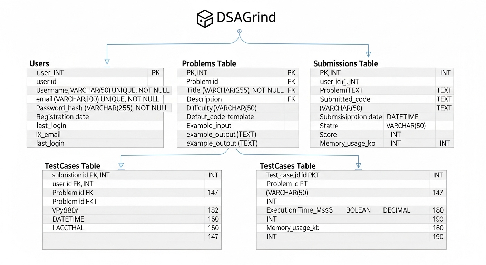

# DSAGrind Platform - Database Design Documentation

## 📋 Document Information
- **Version**: 1.0
- **Created**: 2024
- **System**: DSAGrind Competitive Programming Platform
- **Focus**: Comprehensive Database Architecture and Design
- **Primary Database**: MongoDB Atlas (Document-based NoSQL)

---

## 🎯 Database Architecture Overview



### Database Strategy
DSAGrind employs a **polyglot persistence** approach with multiple specialized data stores:

```
Data Storage Architecture:
├── MongoDB Atlas (Primary Database)
│   ├── User Management
│   ├── Problem Catalog
│   ├── Submissions & Results
│   ├── Payment Records
│   └── Administrative Data
├── Redis Cloud (Caching Layer)
│   ├── Session Storage
│   ├── Query Result Caching
│   ├── Rate Limiting Counters
│   └── Temporary Data
├── Qdrant (Vector Database)
│   ├── Problem Embeddings
│   ├── Code Similarity Search
│   └── Recommendation Engine
└── RabbitMQ CloudAMQP (Message Store)
    ├── Event Persistence
    ├── Dead Letter Queues
    └── Message Routing
```

### Database Selection Rationale

#### **MongoDB Atlas (Primary)**
- **Document Flexibility**: Schema evolution without migrations
- **Rich Querying**: Complex aggregation pipelines
- **Horizontal Scaling**: Automatic sharding capabilities
- **JSON-Native**: Seamless integration with .NET and React
- **Cloud Management**: Automated backups, monitoring, scaling

#### **Redis Cloud (Caching)**
- **In-Memory Performance**: Sub-millisecond response times
- **Data Structures**: Rich data types (strings, hashes, sets, sorted sets)
- **Pub/Sub**: Real-time notifications
- **Persistence Options**: RDB and AOF for durability

#### **Qdrant (Vector Database)**
- **Semantic Search**: Problem recommendation based on code similarity
- **High Performance**: Optimized for vector operations
- **Real-time Updates**: Dynamic index updates
- **Filtering**: Metadata filtering with vector search

---

## 📊 Entity Relationship Design

### Core Entities and Relationships

```
Entity Relationships:
User (1) ←→ (N) Submission
User (1) ←→ (1) UserProfile
User (1) ←→ (N) Payment
User (1) ←→ (N) Subscription
Problem (1) ←→ (N) Submission
Problem (1) ←→ (N) TestCase
Problem (1) ←→ (N) ProblemTag
Submission (1) ←→ (N) TestCaseResult
Contest (1) ←→ (N) Problem
Contest (1) ←→ (N) Participation
```

---

## 🗄️ Detailed Collection Schemas

### 1. Users Collection

#### Schema Definition
```javascript
{
  _id: ObjectId("507f1f77bcf86cd799439011"),
  id: "usr_2Nq8LHnF9X7Y3Z4R5S6T",
  email: "john.doe@example.com",
  username: "johndoe_coder",
  passwordHash: "$2b$12$9LYqJ8x5KQF2mN3pO4rS6T7uV8wX9yZ0A1bC2dE3fG4hI5jK6lM7nO8p",
  role: "User", // User, Premium, Admin, Moderator
  subscription: {
    type: "Premium", // Free, Premium, Pro, Enterprise
    startDate: ISODate("2024-01-01T00:00:00Z"),
    endDate: ISODate("2024-12-31T23:59:59Z"),
    isActive: true,
    autoRenew: true,
    paymentMethodId: "pm_1NvKTGLkdIwHu7ix0KqhrYnK"
  },
  profile: {
    firstName: "John",
    lastName: "Doe",
    displayName: "John Doe",
    bio: "Full-stack developer passionate about algorithms and data structures. Competitive programmer with 3+ years experience.",
    profileImageUrl: "https://dsagrind-assets.s3.amazonaws.com/profiles/usr_2Nq8LHnF9X7Y3Z4R5S6T.jpg",
    bannerImageUrl: "https://dsagrind-assets.s3.amazonaws.com/banners/usr_2Nq8LHnF9X7Y3Z4R5S6T.jpg",
    location: {
      country: "United States",
      state: "California",
      city: "San Francisco"
    },
    dateOfBirth: ISODate("1995-06-15T00:00:00Z"),
    website: "https://johndoe.dev",
    socialLinks: {
      github: "https://github.com/johndoe",
      linkedin: "https://linkedin.com/in/johndoe",
      twitter: "https://twitter.com/johndoe_codes"
    },
    preferredLanguages: ["csharp", "python", "java"],
    programmingExperience: "3-5 years",
    education: {
      degree: "Bachelor of Computer Science",
      university: "Stanford University",
      graduationYear: 2020
    },
    workExperience: {
      currentPosition: "Senior Software Engineer",
      company: "Tech Innovations Inc.",
      yearsOfExperience: 4
    }
  },
  statistics: {
    totalSubmissions: 487,
    acceptedSubmissions: 312,
    acceptanceRate: 64.07,
    problemsSolved: {
      easy: 89,
      medium: 156,
      hard: 67,
      total: 312
    },
    streaks: {
      current: 12,
      longest: 45,
      lastSubmissionDate: ISODate("2024-01-20T14:30:00Z")
    },
    rankings: {
      global: 2847,
      country: 186,
      university: 12
    },
    languageStats: {
      "csharp": {
        submissions: 189,
        accepted: 134,
        acceptanceRate: 70.89
      },
      "python": {
        submissions: 142,
        accepted: 98,
        acceptanceRate: 69.01
      },
      "java": {
        submissions: 156,
        accepted: 80,
        acceptanceRate: 51.28
      }
    },
    categoryStats: {
      "arrays": { solved: 45, total: 67 },
      "dynamic-programming": { solved: 23, total: 89 },
      "trees": { solved: 34, total: 56 },
      "graphs": { solved: 12, total: 45 }
    },
    contestParticipation: {
      totalContests: 23,
      averageRank: 1847,
      bestRank: 234,
      ratingHistory: [
        { date: ISODate("2024-01-01T00:00:00Z"), rating: 1456 },
        { date: ISODate("2024-01-15T00:00:00Z"), rating: 1523 },
        { date: ISODate("2024-02-01T00:00:00Z"), rating: 1487 }
      ]
    }
  },
  preferences: {
    theme: "dark", // light, dark, auto
    editorSettings: {
      fontSize: 14,
      fontFamily: "Fira Code",
      theme: "vs-dark",
      tabSize: 4,
      wordWrap: true,
      minimap: false,
      autoSave: true
    },
    notifications: {
      email: {
        weeklyProgress: true,
        contestReminders: true,
        newProblems: false,
        achievements: true
      },
      push: {
        enabled: true,
        contestStart: true,
        friendActivity: false
      }
    },
    privacy: {
      profileVisibility: "public", // public, friends, private
      submissionVisibility: "public",
      showRealName: true,
      showLocation: true
    }
  },
  security: {
    twoFactorEnabled: true,
    backupCodes: ["1a2b3c4d", "5e6f7g8h", "9i0j1k2l"],
    lastPasswordChange: ISODate("2023-12-01T00:00:00Z"),
    loginHistory: [
      {
        timestamp: ISODate("2024-01-20T09:15:00Z"),
        ipAddress: "192.168.1.100",
        userAgent: "Mozilla/5.0 (Windows NT 10.0; Win64; x64) AppleWebKit/537.36",
        location: "San Francisco, CA",
        success: true
      }
    ],
    refreshTokens: [
      {
        token: "rt_9X8Y7Z6W5V4U3T2S1R0Q",
        expiresAt: ISODate("2024-02-20T00:00:00Z"),
        createdAt: ISODate("2024-01-20T09:15:00Z"),
        lastUsed: ISODate("2024-01-20T14:30:00Z"),
        deviceInfo: "Chrome on Windows"
      }
    ]
  },
  metadata: {
    createdAt: ISODate("2023-06-15T10:30:00Z"),
    updatedAt: ISODate("2024-01-20T14:30:00Z"),
    lastLoginAt: ISODate("2024-01-20T09:15:00Z"),
    emailVerified: true,
    emailVerificationToken: null,
    accountStatus: "active", // active, suspended, banned, pending
    flags: ["early_adopter", "beta_tester"],
    referralCode: "JOHN2024",
    referredBy: null,
    totalReferrals: 3
  }
}
```

#### Indexes
```javascript
// Unique indexes
db.users.createIndex({ "email": 1 }, { unique: true });
db.users.createIndex({ "username": 1 }, { unique: true });

// Performance indexes
db.users.createIndex({ "statistics.rankings.global": 1 });
db.users.createIndex({ "statistics.problemsSolved.total": -1 });
db.users.createIndex({ "subscription.type": 1, "subscription.isActive": 1 });
db.users.createIndex({ "metadata.createdAt": -1 });

// Security indexes
db.users.createIndex({ "security.refreshTokens.token": 1 });
db.users.createIndex({ "metadata.emailVerificationToken": 1 });

// Compound indexes for complex queries
db.users.createIndex({ 
  "statistics.rankings.global": 1, 
  "subscription.type": 1,
  "metadata.accountStatus": 1 
});
```

### 2. Problems Collection

#### Schema Definition
```javascript
{
  _id: ObjectId("507f1f77bcf86cd799439012"),
  id: "prob_8M9N0O1P2Q3R4S5T6U7V",
  title: "Two Sum Advanced",
  slug: "two-sum-advanced",
  description: {
    statement: "Given an array of integers `nums` and an integer `target`, return indices of the two numbers such that they add up to target...",
    inputFormat: "The first line contains an integer n, the size of the array...",
    outputFormat: "Return an array of two integers representing the indices...",
    constraints: [
      "2 ≤ nums.length ≤ 10^4",
      "-10^9 ≤ nums[i] ≤ 10^9",
      "-10^9 ≤ target ≤ 10^9",
      "Only one valid answer exists"
    ],
    timeComplexity: "O(n)",
    spaceComplexity: "O(n)"
  },
  difficulty: "Medium", // Easy, Medium, Hard
  difficultyScore: 1650, // Numeric difficulty rating (1000-3000)
  category: "Arrays and Hashing",
  tags: [
    { name: "array", weight: 1.0 },
    { name: "hash-table", weight: 1.0 },
    { name: "two-pointers", weight: 0.7 }
  ],
  topicTags: [
    "Data Structures",
    "Algorithms",
    "Hash Table",
    "Array"
  ],
  companyTags: [
    { name: "Google", frequency: "high", lastSeen: ISODate("2024-01-15T00:00:00Z") },
    { name: "Amazon", frequency: "medium", lastSeen: ISODate("2024-01-10T00:00:00Z") },
    { name: "Microsoft", frequency: "medium", lastSeen: ISODate("2023-12-20T00:00:00Z") }
  ],
  examples: [
    {
      id: "ex_1",
      input: "nums = [2,7,11,15], target = 9",
      output: "[0,1]",
      explanation: "Because nums[0] + nums[1] == 9, we return [0, 1]."
    },
    {
      id: "ex_2", 
      input: "nums = [3,2,4], target = 6",
      output: "[1,2]",
      explanation: "Because nums[1] + nums[2] == 6, we return [1, 2]."
    }
  ],
  testCases: [
    {
      id: "tc_1",
      input: "[2,7,11,15]\n9",
      expectedOutput: "[0,1]",
      isPublic: true,
      isExample: true,
      timeLimit: 1000,
      memoryLimit: 256,
      difficulty: "easy"
    },
    {
      id: "tc_2",
      input: "[3,2,4]\n6", 
      expectedOutput: "[1,2]",
      isPublic: true,
      isExample: true,
      timeLimit: 1000,
      memoryLimit: 256,
      difficulty: "easy"
    },
    {
      id: "tc_3",
      input: "[3,3]\n6",
      expectedOutput: "[0,1]",
      isPublic: false,
      isExample: false,
      timeLimit: 1000,
      memoryLimit: 256,
      difficulty: "medium"
    }
    // ... more test cases
  ],
  hints: [
    {
      level: 1,
      content: "A really brute force way would be to search for all possible pairs of numbers but that would be too slow. Again, it's best to try out brute force solutions for just for completeness. It is from these brute force solutions that you can come up with optimizations.",
      isPremium: false
    },
    {
      level: 2,
      content: "So, if we fix one of the numbers, say x, we have to scan the entire array to find the next number y which is value - x where value is the input parameter. Can we change our array somehow so that this search becomes faster?",
      isPremium: false
    },
    {
      level: 3,
      content: "The second train of thought is, without changing the array, can we use additional space somehow? Like maybe a hash map to speed up the search?",
      isPremium: true
    }
  ],
  solutions: [
    {
      id: "sol_1",
      approach: "Brute Force",
      language: "csharp",
      code: "public class Solution {\n    public int[] TwoSum(int[] nums, int target) {\n        for (int i = 0; i < nums.Length; i++) {\n            for (int j = i + 1; j < nums.Length; j++) {\n                if (nums[i] + nums[j] == target) {\n                    return new int[] { i, j };\n                }\n            }\n        }\n        return new int[] { };\n    }\n}",
      timeComplexity: "O(n²)",
      spaceComplexity: "O(1)",
      isPremium: false,
      explanation: "Check every possible pair of numbers to see if they sum to the target."
    },
    {
      id: "sol_2",
      approach: "Hash Map",
      language: "csharp", 
      code: "public class Solution {\n    public int[] TwoSum(int[] nums, int target) {\n        Dictionary<int, int> map = new Dictionary<int, int>();\n        \n        for (int i = 0; i < nums.Length; i++) {\n            int complement = target - nums[i];\n            if (map.ContainsKey(complement)) {\n                return new int[] { map[complement], i };\n            }\n            map[nums[i]] = i;\n        }\n        \n        return new int[] { };\n    }\n}",
      timeComplexity: "O(n)",
      spaceComplexity: "O(n)",
      isPremium: true,
      explanation: "Use a hash map to store numbers we've seen and their indices. For each number, check if its complement exists in the map."
    }
  ],
  statistics: {
    totalSubmissions: 15847,
    acceptedSubmissions: 8956,
    acceptanceRate: 56.52,
    averageRating: 4.2,
    totalRatings: 1205,
    languageStats: {
      "csharp": { submissions: 4521, accepted: 2789, rate: 61.70 },
      "python": { submissions: 5890, accepted: 3245, rate: 55.11 },
      "java": { submissions: 3456, accepted: 1923, rate: 55.64 },
      "cpp": { submissions: 1456, accepted: 756, rate: 51.92 },
      "javascript": { submissions: 524, accepted: 243, rate: 46.37 }
    },
    difficultyVotes: {
      easy: 156,
      medium: 892,
      hard: 157
    },
    performanceMetrics: {
      averageRuntime: 85, // milliseconds
      averageMemory: 42.3, // MB
      fastestSubmission: {
        runtime: 52,
        userId: "usr_fastcoder123",
        submissionId: "sub_lightning_fast"
      }
    }
  },
  editorial: {
    id: "edit_two_sum_advanced",
    content: "## Approach 1: Brute Force\n\nThe brute force approach is simple...",
    author: "DSAGrind Editorial Team",
    publishedAt: ISODate("2024-01-01T00:00:00Z"),
    isPremium: true,
    viewCount: 5623,
    upvotes: 423,
    downvotes: 12
  },
  relatedProblems: [
    {
      problemId: "prob_3sum_challenge",
      title: "3Sum",
      difficulty: "Medium",
      similarity: 0.85
    },
    {
      problemId: "prob_two_sum_ii",
      title: "Two Sum II - Input Array Is Sorted", 
      difficulty: "Medium",
      similarity: 0.92
    }
  ],
  metadata: {
    createdBy: "usr_admin_creator",
    createdAt: ISODate("2023-08-15T10:00:00Z"),
    updatedAt: ISODate("2024-01-18T14:22:00Z"),
    lastModifiedBy: "usr_editor_john",
    version: 3,
    isActive: true,
    isPremium: false,
    isContest: false,
    contestIds: ["contest_weekly_45", "contest_monthly_12"],
    sourceUrl: "https://leetcode.com/problems/two-sum/",
    originalPlatform: "LeetCode",
    difficulty_history: [
      { difficulty: "Easy", changedAt: ISODate("2023-08-15T10:00:00Z"), changedBy: "usr_admin_creator" },
      { difficulty: "Medium", changedAt: ISODate("2024-01-10T09:30:00Z"), changedBy: "usr_editor_john" }
    ]
  }
}
```

#### Indexes
```javascript
// Search and filtering indexes
db.problems.createIndex({ "title": "text", "description.statement": "text" });
db.problems.createIndex({ "difficulty": 1, "tags.name": 1 });
db.problems.createIndex({ "category": 1, "difficulty": 1 });
db.problems.createIndex({ "statistics.acceptanceRate": -1 });

// Performance indexes
db.problems.createIndex({ "metadata.isActive": 1, "metadata.isPremium": 1 });
db.problems.createIndex({ "metadata.createdAt": -1 });
db.problems.createIndex({ "difficultyScore": 1 });

// Tag-based queries
db.problems.createIndex({ "tags.name": 1, "difficulty": 1 });
db.problems.createIndex({ "companyTags.name": 1, "companyTags.frequency": 1 });

// Compound indexes for complex queries
db.problems.createIndex({ 
  "metadata.isActive": 1,
  "difficulty": 1,
  "statistics.acceptanceRate": -1 
});
```

### 3. Submissions Collection

#### Schema Definition
```javascript
{
  _id: ObjectId("507f1f77bcf86cd799439013"),
  id: "sub_5K6L7M8N9O0P1Q2R3S4T",
  userId: "usr_2Nq8LHnF9X7Y3Z4R5S6T",
  problemId: "prob_8M9N0O1P2Q3R4S5T6U7V",
  contestId: null, // "contest_weekly_45" if submitted during contest
  sessionId: "session_coding_12345", // For tracking coding sessions
  code: {
    source: "public class Solution {\n    public int[] TwoSum(int[] nums, int target) {\n        Dictionary<int, int> map = new Dictionary<int, int>();\n        \n        for (int i = 0; i < nums.Length; i++) {\n            int complement = target - nums[i];\n            if (map.ContainsKey(complement)) {\n                return new int[] { map[complement], i };\n            }\n            map[nums[i]] = i;\n        }\n        \n        return new int[] { };\n    }\n}",
    language: "csharp",
    languageVersion: "net8.0",
    codeLength: 456, // characters
    linesOfCode: 14
  },
  execution: {
    status: "Accepted", // Pending, Running, Accepted, WrongAnswer, RuntimeError, TimeLimitExceeded, MemoryLimitExceeded, CompilationError
    statusCode: 0,
    statusMessage: "All test cases passed successfully",
    submittedAt: ISODate("2024-01-20T14:30:00Z"),
    startedAt: ISODate("2024-01-20T14:30:02Z"),
    completedAt: ISODate("2024-01-20T14:30:08Z"),
    totalExecutionTime: 6234, // milliseconds
    compileTime: 1250, // milliseconds
    runTime: 4984, // milliseconds
    containerInfo: {
      containerId: "container_abc123def456",
      imageId: "dsagrind/csharp-runner:8.0",
      resourceLimits: {
        memory: 268435456, // 256MB in bytes
        cpu: 0.5, // 50% CPU
        timeLimit: 5000 // 5 seconds
      }
    }
  },
  results: {
    passedTestCases: 15,
    totalTestCases: 15,
    passRate: 100.0,
    score: 100,
    testCaseResults: [
      {
        testCaseId: "tc_1",
        status: "Passed",
        input: "[2,7,11,15]\n9",
        expectedOutput: "[0,1]", 
        actualOutput: "[0,1]",
        executionTime: 45, // milliseconds
        memoryUsed: 2147483, // bytes
        isPublic: true,
        pointsEarned: 10
      },
      {
        testCaseId: "tc_2",
        status: "Passed", 
        input: "[3,2,4]\n6",
        expectedOutput: "[1,2]",
        actualOutput: "[1,2]",
        executionTime: 52,
        memoryUsed: 2156789,
        isPublic: true,
        pointsEarned: 10
      }
      // ... more test case results
    ],
    performanceMetrics: {
      averageExecutionTime: 48.7,
      maxMemoryUsed: 2267834,
      totalMemoryAllocated: 268435456,
      memoryEfficiency: 0.845, // percentage of allocated memory used
      timeEfficiency: 0.976, // percentage of time limit used
      codeQualityScore: 8.5, // AI-generated score (1-10)
      optimizationSuggestions: [
        "Consider using Array.IndexOf for cleaner code",
        "Variable naming could be more descriptive"
      ]
    }
  },
  analysis: {
    timeComplexity: {
      estimated: "O(n)",
      confidence: 0.95,
      explanation: "Single pass through array with constant-time hash table operations"
    },
    spaceComplexity: {
      estimated: "O(n)",
      confidence: 0.92,
      explanation: "Hash table storage grows linearly with input size"
    },
    codeStyle: {
      score: 8.5,
      issues: [
        { type: "naming", severity: "minor", line: 3, message: "Variable 'i' could be more descriptive" },
        { type: "spacing", severity: "minor", line: 8, message: "Consider adding blank line for readability" }
      ],
      strengths: [
        "Good use of Dictionary for O(1) lookups",
        "Proper error handling",
        "Clean algorithm implementation"
      ]
    },
    similarities: [
      {
        submissionId: "sub_other_user_123",
        similarity: 0.23,
        commonLines: 3,
        suspiciousLevel: "low"
      }
    ]
  },
  feedback: {
    aiGeneratedHints: [
      "Great job using a hash map for efficient lookups!",
      "Your solution has optimal time complexity O(n).",
      "Consider adding input validation for edge cases."
    ],
    performanceComparison: {
      percentile: 85.7, // User's solution performance vs all submissions
      betterThan: 85.7,
      runtimeDistribution: {
        fastest: 35,
        median: 67,
        slowest: 245,
        userRuntime: 48
      }
    },
    nextRecommendations: [
      {
        problemId: "prob_3sum_challenge",
        reason: "Similar hash table concepts",
        difficulty: "Medium"
      },
      {
        problemId: "prob_two_sum_ii", 
        reason: "Extension of current problem",
        difficulty: "Medium"
      }
    ]
  },
  metadata: {
    ipAddress: "192.168.1.100",
    userAgent: "Mozilla/5.0 (Windows NT 10.0; Win64; x64) AppleWebKit/537.36",
    deviceInfo: {
      platform: "Windows",
      browser: "Chrome",
      screenResolution: "1920x1080",
      timezone: "America/Los_Angeles"
    },
    editorInfo: {
      theme: "vs-dark",
      fontSize: 14,
      keystrokes: 1247,
      codingTime: 1825000, // milliseconds spent coding
      pauses: [
        { startTime: 456000, duration: 124000, reason: "thinking" },
        { startTime: 892000, duration: 89000, reason: "debugging" }
      ]
    },
    flags: ["first_attempt", "optimized_solution"],
    tags: ["interview_practice", "self_study"],
    isPrivate: false,
    shareableUrl: "https://dsagrind.com/submissions/sub_5K6L7M8N9O0P1Q2R3S4T"
  }
}
```

#### Indexes
```javascript
// User-centric queries
db.submissions.createIndex({ "userId": 1, "submittedAt": -1 });
db.submissions.createIndex({ "userId": 1, "execution.status": 1 });
db.submissions.createIndex({ "userId": 1, "problemId": 1, "submittedAt": -1 });

// Problem-centric queries
db.submissions.createIndex({ "problemId": 1, "execution.status": 1 });
db.submissions.createIndex({ "problemId": 1, "submittedAt": -1 });

// Performance queries
db.submissions.createIndex({ "execution.status": 1, "submittedAt": -1 });
db.submissions.createIndex({ "results.performanceMetrics.averageExecutionTime": 1 });

// Contest queries
db.submissions.createIndex({ "contestId": 1, "submittedAt": 1 });
db.submissions.createIndex({ "contestId": 1, "userId": 1, "results.score": -1 });

// Analytics queries
db.submissions.createIndex({ "code.language": 1, "execution.status": 1 });
db.submissions.createIndex({ "submittedAt": -1 }); // Time-series analysis
```

### 4. Additional Collections

#### Contests Collection
```javascript
{
  _id: ObjectId("507f1f77bcf86cd799439014"),
  id: "contest_weekly_67",
  title: "Weekly Contest 67",
  type: "weekly", // weekly, biweekly, monthly, special
  status: "upcoming", // upcoming, live, completed, cancelled
  schedule: {
    startTime: ISODate("2024-02-01T18:00:00Z"),
    endTime: ISODate("2024-02-01T19:30:00Z"),
    duration: 5400, // seconds (90 minutes)
    timezone: "UTC"
  },
  problems: [
    {
      problemId: "prob_contest_q1",
      order: 1,
      points: 100,
      title: "Array Manipulation",
      difficulty: "Easy"
    },
    {
      problemId: "prob_contest_q2", 
      order: 2,
      points: 200,
      title: "String Algorithms",
      difficulty: "Medium"
    }
  ],
  participants: {
    registered: 1247,
    active: 892,
    completed: 567
  },
  leaderboard: [
    {
      userId: "usr_champion_coder",
      rank: 1,
      score: 400,
      penalty: 1247, // seconds
      submissions: [
        { problemId: "prob_contest_q1", attempts: 1, time: 342, score: 100 },
        { problemId: "prob_contest_q2", attempts: 2, time: 1247, score: 300 }
      ]
    }
  ],
  settings: {
    isPremium: false,
    allowedLanguages: ["csharp", "python", "java", "cpp"],
    penaltyPerWrongSubmission: 300, // seconds
    isRated: true,
    maxSubmissions: 50
  }
}
```

#### Payments Collection
```javascript
{
  _id: ObjectId("507f1f77bcf86cd799439015"),
  id: "pay_8X9Y0Z1A2B3C4D5E6F7G",
  userId: "usr_2Nq8LHnF9X7Y3Z4R5S6T",
  type: "subscription", // subscription, one-time, upgrade, refund
  status: "completed", // pending, processing, completed, failed, refunded
  amount: {
    currency: "USD",
    total: 9.99,
    subtotal: 9.99,
    tax: 0.0,
    discount: 0.0,
    fees: 0.0
  },
  paymentMethod: {
    type: "card",
    provider: "stripe",
    last4: "4242",
    brand: "visa",
    expiryMonth: 12,
    expiryYear: 2026
  },
  subscription: {
    plan: "premium_monthly",
    billingCycle: "monthly",
    startDate: ISODate("2024-01-01T00:00:00Z"),
    endDate: ISODate("2024-02-01T00:00:00Z"),
    autoRenew: true
  },
  stripe: {
    paymentIntentId: "pi_1NvKTGLkdIwHu7ix0KqhrYnK",
    customerId: "cus_NffrFeUfNV2Hib",
    subscriptionId: "sub_1NvKTGLkdIwHu7ix0KqhrYnK"
  },
  timestamps: {
    createdAt: ISODate("2024-01-01T10:30:00Z"),
    processedAt: ISODate("2024-01-01T10:30:15Z"),
    completedAt: ISODate("2024-01-01T10:30:18Z")
  }
}
```

---

## 🗃️ Caching Strategy (Redis)

### Cache Key Patterns
```
Cache Key Structure:
├── User Data
│   ├── user:profile:{userId}
│   ├── user:stats:{userId}
│   ├── user:submissions:{userId}:page:{pageNumber}
│   └── user:preferences:{userId}
├── Problem Data
│   ├── problem:details:{problemId}
│   ├── problems:list:page:{pageNumber}:filters:{filterHash}
│   ├── problem:stats:{problemId}
│   └── problem:leaderboard:{problemId}
├── Session Data
│   ├── session:{sessionId}
│   ├── auth:token:{userId}:{tokenHash}
│   └── rate_limit:{userId}:{endpoint}
└── Application Cache
    ├── leaderboard:global:page:{pageNumber}
    ├── contests:upcoming
    └── system:stats:daily
```

### Caching Implementation
```javascript
// Redis Data Structures and TTL
{
  // User profile cache (Hash)
  "user:profile:usr_123": {
    data: JSON.stringify(userProfileObject),
    ttl: 3600 // 1 hour
  },
  
  // Problem list cache (String)
  "problems:list:page:1:filters:difficulty-medium": {
    data: JSON.stringify(problemListArray),
    ttl: 900 // 15 minutes
  },
  
  // Session cache (Hash) 
  "session:sess_abc123": {
    userId: "usr_123",
    loginTime: "1642781234",
    lastActivity: "1642784567",
    ttl: 86400 // 24 hours
  },
  
  // Rate limiting (String with expire)
  "rate_limit:usr_123:submissions": {
    count: "5",
    ttl: 3600 // Reset every hour
  },
  
  // Leaderboard cache (Sorted Set)
  "leaderboard:global": {
    "usr_123": 1547, // score
    "usr_456": 1523,
    "usr_789": 1489,
    ttl: 300 // 5 minutes
  }
}
```

---

## 🔍 Vector Database Design (Qdrant)

### Problem Embeddings Collection
```javascript
{
  collection_name: "problem_embeddings",
  vectors: {
    size: 1536, // OpenAI ada-002 embedding size
    distance: "Cosine"
  },
  payload_schema: {
    problem_id: "string",
    title: "string", 
    difficulty: "string",
    tags: ["string"],
    description_hash: "string",
    created_at: "datetime",
    embedding_version: "string"
  },
  indexes: [
    { field: "difficulty", type: "keyword" },
    { field: "tags", type: "keyword" },
    { field: "created_at", type: "datetime" }
  ]
}

// Example vector point
{
  id: "prob_8M9N0O1P2Q3R4S5T6U7V",
  vector: [0.123, -0.456, 0.789, ...], // 1536 dimensions
  payload: {
    problem_id: "prob_8M9N0O1P2Q3R4S5T6U7V",
    title: "Two Sum Advanced",
    difficulty: "Medium",
    tags: ["array", "hash-table", "two-pointers"],
    description_hash: "sha256_hash_of_description",
    created_at: "2024-01-01T00:00:00Z",
    embedding_version: "ada-002-v1"
  }
}
```

### Code Similarity Collection
```javascript
{
  collection_name: "code_embeddings",
  vectors: {
    size: 768, // CodeBERT embedding size
    distance: "Cosine"
  },
  payload_schema: {
    submission_id: "string",
    user_id: "string",
    problem_id: "string", 
    language: "string",
    code_hash: "string",
    performance_score: "float",
    created_at: "datetime"
  }
}
```

---

## 🔄 Data Migration Strategies

### Schema Evolution Patterns
```javascript
// Version-based document evolution
{
  _id: ObjectId("..."),
  id: "usr_123",
  schemaVersion: 3, // Current version
  
  // Migration tracking
  migrations: [
    { version: 2, appliedAt: ISODate("2024-01-01T00:00:00Z"), changes: ["added_statistics"] },
    { version: 3, appliedAt: ISODate("2024-01-15T00:00:00Z"), changes: ["refactored_preferences"] }
  ],
  
  // Backward compatibility fields
  deprecated: {
    oldFieldName: "value", // Kept for backward compatibility
    _deprecatedAt: ISODate("2024-01-01T00:00:00Z")
  }
}
```

### Data Consistency Patterns
```javascript
// Two-Phase Commit for Critical Operations
// Phase 1: Prepare
{
  _id: ObjectId("..."),
  transactionId: "txn_abc123",
  status: "prepared", // prepared, committed, aborted
  operations: [
    { collection: "users", operation: "update", id: "usr_123", changes: {...} },
    { collection: "submissions", operation: "create", id: "sub_456", data: {...} }
  ],
  timestamp: ISODate("2024-01-01T00:00:00Z"),
  ttl: ISODate("2024-01-01T00:05:00Z") // 5 minute timeout
}

// Phase 2: Commit/Abort
{
  transactionId: "txn_abc123",
  status: "committed",
  completedAt: ISODate("2024-01-01T00:00:30Z")
}
```

---

## 📊 Performance Optimization

### Query Optimization Strategies

#### Index Usage Monitoring
```javascript
// Slow query detection
db.runCommand({
  profile: 2,
  slowms: 100,
  sampleRate: 0.1
});

// Index usage analysis
db.users.aggregate([
  { $indexStats: {} }
]);
```

#### Query Patterns
```javascript
// Efficient pagination with range queries
db.submissions.find({
  userId: "usr_123",
  submittedAt: { $lt: lastSeenTimestamp }
}).sort({ submittedAt: -1 }).limit(20);

// Aggregation pipeline for statistics
db.submissions.aggregate([
  { $match: { userId: "usr_123", "execution.status": "Accepted" } },
  { $group: {
    _id: "$code.language",
    count: { $sum: 1 },
    avgRuntime: { $avg: "$results.performanceMetrics.averageExecutionTime" }
  }},
  { $sort: { count: -1 } }
]);
```

### Sharding Strategy
```javascript
// Shard key selection for horizontal scaling
{
  // Users collection: Shard by userId hash
  shardKey: { "id": "hashed" },
  
  // Submissions collection: Shard by userId + timestamp  
  shardKey: { "userId": 1, "submittedAt": 1 },
  
  // Problems collection: Shard by category
  shardKey: { "category": 1, "difficulty": 1 }
}
```

---

## 🔒 Data Security and Compliance

### Encryption Strategies
```javascript
// Field-level encryption for sensitive data
{
  userId: "usr_123",
  email: "john.doe@example.com", // Encrypted at rest
  personalInfo: {
    // Client-side field level encryption
    ssn: "encrypted_ssn_value",
    dateOfBirth: "encrypted_dob_value"
  },
  
  // Searchable encryption for email queries
  emailHash: "sha256_hash_for_indexing",
  
  // Audit trail
  accessLog: [
    { 
      accessedBy: "usr_456",
      accessType: "read",
      timestamp: ISODate("2024-01-01T00:00:00Z"),
      ipAddress: "192.168.1.100"
    }
  ]
}
```

### GDPR Compliance
```javascript
// User data deletion tracking
{
  deletionRequest: {
    requestedAt: ISODate("2024-01-01T00:00:00Z"),
    requestedBy: "usr_123",
    status: "processing", // pending, processing, completed
    dataCategories: ["profile", "submissions", "payments"],
    retentionExceptions: ["legal_hold", "active_subscription"],
    completedAt: null,
    verificationRequired: true
  },
  
  // Data anonymization for analytics
  anonymizedData: {
    submissionStats: { /* anonymized stats */ },
    performanceMetrics: { /* anonymized performance */ }
  }
}
```

This comprehensive database design provides a robust foundation for the DSAGrind platform, ensuring scalability, performance, and maintainability while supporting all features of a modern competitive programming platform.