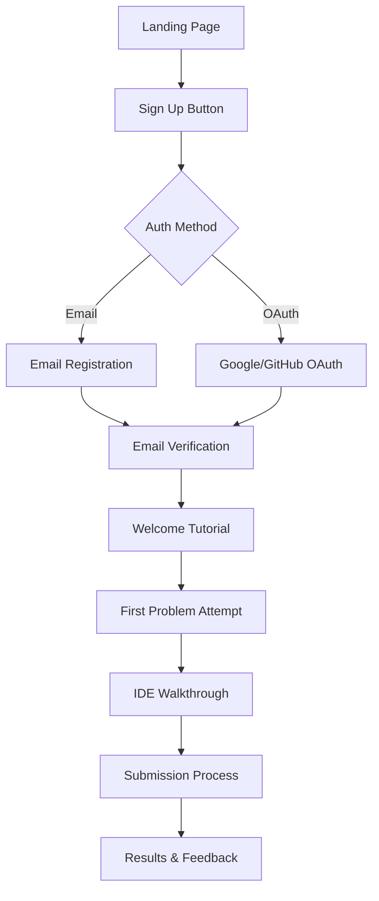
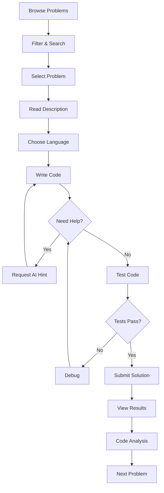
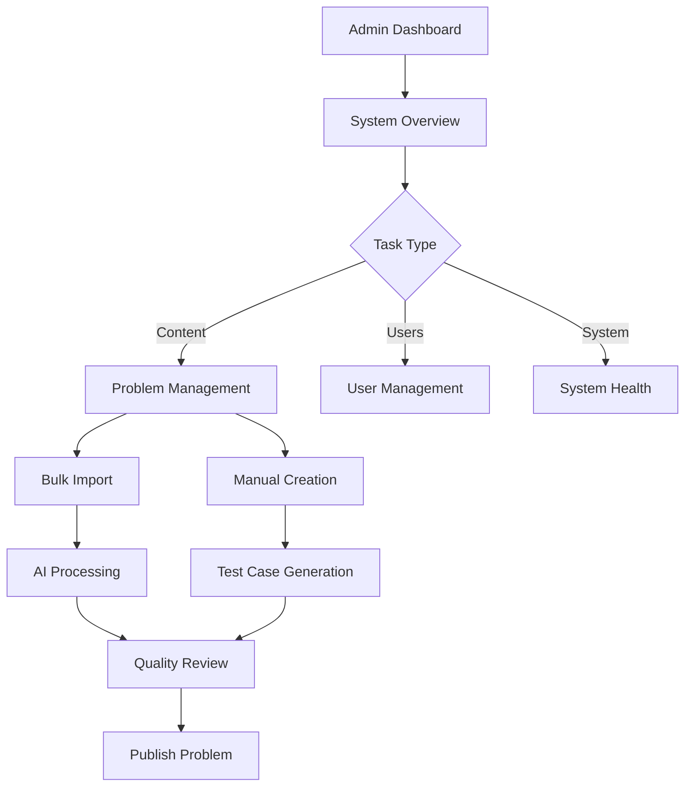
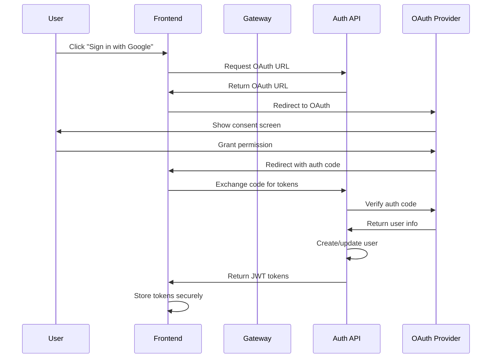
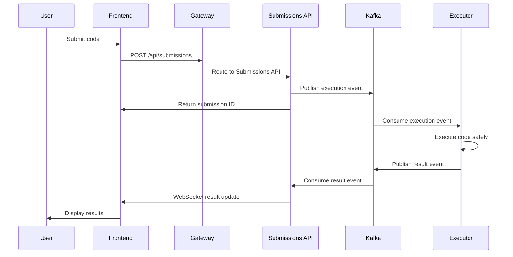
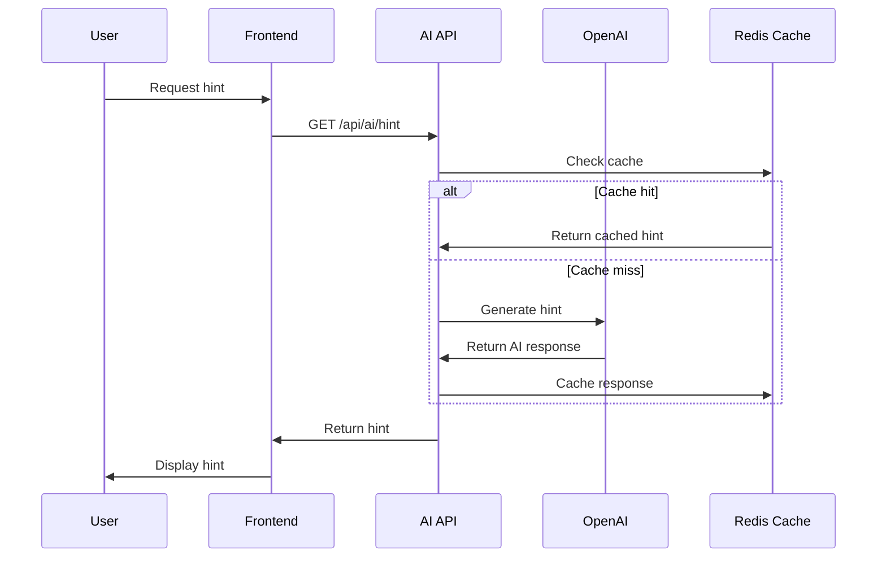

# DSAGrind - User Flows & Case Studies

## 🎯 Core User Journeys

### 1. New User Registration & Onboarding

**Steps:**
1. **Landing Page**: User discovers platform
2. **Registration**: Choose email or OAuth method
3. **Verification**: Email confirmation for security
4. **Onboarding**: Interactive tutorial showing key features
5. **First Attempt**: Guided problem solving experience
6. **Success**: User understands platform value proposition

**AI Touchpoints:**
- Problem recommendation based on skill assessment
- Hints during first attempt
- Code quality feedback

### 2. Problem Solving Journey

**Key Features:**
- **Smart Filtering**: Category, difficulty, tags
- **Monaco IDE**: Professional code editor
- **AI Assistance**: Progressive hints system
- **Real-time Testing**: Instant feedback
- **Code Analysis**: AI-powered quality review

### 3. Admin Workflow

## 📚 Detailed Case Studies

### Case Study 1: Competitive Programmer's Journey

**User Profile**: Sarah, Computer Science student
**Goal**: Prepare for coding interviews at FAANG companies

**Day 1-7: Foundation Building**
- Completes skill assessment (AI-generated problems)
- System recommends "Arrays & Hashing" category
- Solves 10 easy problems with AI hints
- Learns pattern recognition

**Day 8-30: Skill Development**
- Progresses to medium difficulty
- Uses AI code analysis for optimization
- Participates in mock contests
- Tracks progress metrics

**Day 31-90: Mastery**
- Tackles hard problems independently
- Mentors other users in discussions
- Contributes to problem database
- Achieves target interview readiness

**Metrics:**
- 150+ problems solved
- 85% submission success rate
- Top 10% in monthly contest
- 4.8/5 code quality score

### Case Study 2: Educational Institution Integration

**Organization**: State University CS Department
**Challenge**: Standardize coding practice across 500+ students

**Implementation Phase 1: Setup**
- Admin creates institutional account
- Bulk imports curriculum-aligned problems
- Sets up automated grading system
- Configures student progress tracking

**Phase 2: Classroom Integration**
- Professors assign weekly problem sets
- Students collaborate using real-time features
- AI provides instant feedback reducing TA workload
- Analytics track class performance

**Phase 3: Assessment**
- Automated plagiarism detection
- Comprehensive progress reports
- Individualized learning paths
- Integration with existing LMS

**Results:**
- 40% reduction in grading time
- 25% improvement in student engagement
- 90% student satisfaction score
- Seamless LMS integration

### Case Study 3: Corporate Training Program

**Company**: Mid-size Tech Startup (200 engineers)
**Objective**: Upskill development team in algorithms

**Pre-Implementation Assessment**
- Skills gap analysis using AI testing
- Identified weak areas: Dynamic Programming, Graph Algorithms
- Set 3-month improvement timeline

**Training Program Design**
- Customized learning tracks per experience level
- Weekly team challenges and leaderboards
- Peer code review sessions
- Expert-level problem creation

**Ongoing Support**
- AI-powered code reviews in development
- Integration with code quality tools
- Monthly skill assessments
- Gamified learning with rewards

**Outcomes:**
- 60% improvement in algorithmic thinking
- 30% faster code review cycles
- 15% reduction in production bugs
- Improved team collaboration

## 🔄 System Integration Flows

### Authentication Flow (OAuth)

### Code Submission Flow

### AI Assistance Flow

## 📊 Analytics & Metrics

### User Engagement Metrics
- **Daily Active Users**: Track solving activity
- **Session Duration**: Time spent on platform
- **Problem Completion Rate**: Success percentage
- **Streak Tracking**: Consecutive solving days

### Learning Analytics
- **Skill Progression**: Track improvement over time
- **Weakness Identification**: Struggling topics
- **Hint Usage Patterns**: Learning dependency
- **Code Quality Evolution**: Writing improvement

### System Performance
- **Response Times**: API endpoint performance
- **Error Rates**: System reliability
- **Resource Usage**: Scaling requirements
- **Cache Hit Rates**: Optimization effectiveness

## 🎮 Gamification Elements

### Achievement System
- **Problem Solver**: Complete X problems
- **Streak Master**: Y consecutive days
- **Language Explorer**: Code in Z languages
- **Helper**: Assist other users

### Leaderboards
- **Global Rankings**: Overall performance
- **Category Leaders**: Topic-specific excellence
- **Monthly Contests**: Time-bound challenges
- **Team Competitions**: Collaborative solving

### Progress Visualization
- **Skill Trees**: Visual learning paths
- **Progress Bars**: Completion tracking
- **Heat Maps**: Activity visualization
- **Code Quality Scores**: Improvement tracking

## 🔄 Continuous Improvement Loop

### Feedback Collection
1. **User Surveys**: Regular satisfaction checks
2. **Usage Analytics**: Behavior pattern analysis
3. **Error Monitoring**: Technical issue tracking
4. **Performance Metrics**: System optimization data

### Feature Development
1. **Requirement Analysis**: User need assessment
2. **Technical Planning**: Architecture decisions
3. **Implementation**: Agile development process
4. **Testing**: Quality assurance validation

### Deployment & Monitoring
1. **Gradual Rollout**: Feature flag management
2. **A/B Testing**: Performance comparison
3. **User Feedback**: Real-world validation
4. **Optimization**: Continuous enhancement