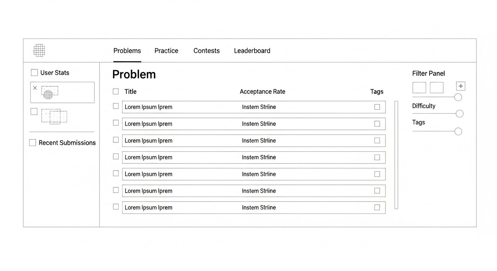
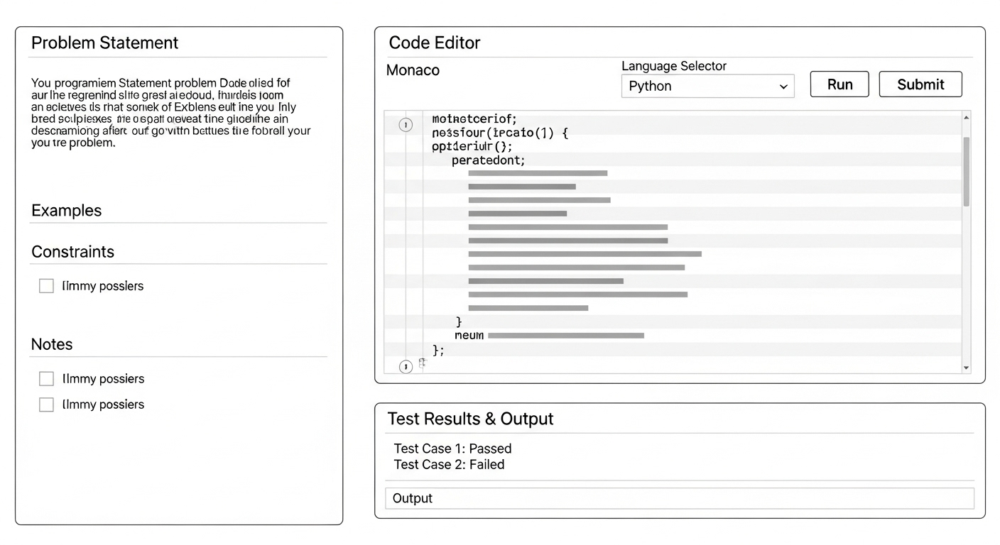
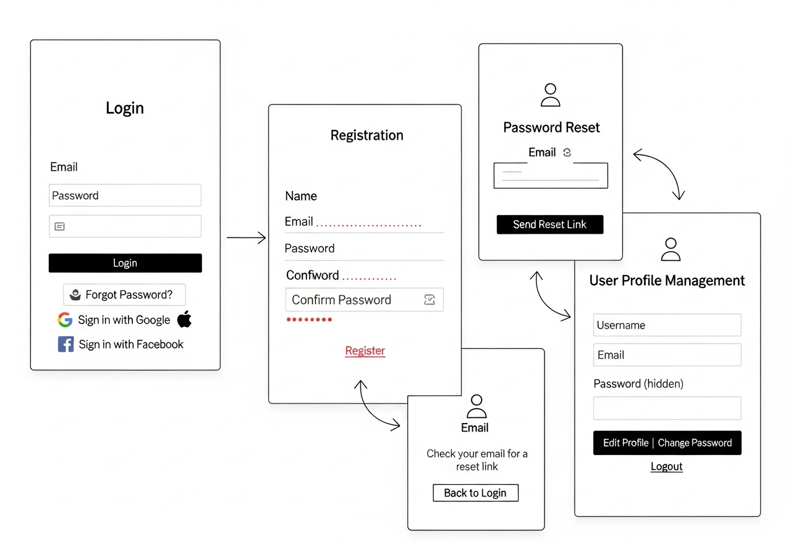

# DSAGrind Platform - Wireframe Documentation

## 📋 Document Information
- **Version**: 1.0
- **Created**: 2024
- **System**: DSAGrind Competitive Programming Platform
- **Focus**: User Interface Design and User Experience
- **Design System**: Responsive, Mobile-First Approach

---

## 🎨 Design Overview

### Visual Design Language
DSAGrind follows a clean, modern design philosophy optimized for competitive programming:
- **Typography**: Monospace fonts for code, Sans-serif for content
- **Color Scheme**: Dark mode primary with light mode support
- **Layout**: Clean, distraction-free interface
- **Accessibility**: WCAG 2.1 AA compliant
- **Responsive**: Mobile-first responsive design

---

## 🏠 Dashboard Interface



### Dashboard Layout Components

#### 1. **Header Navigation**
```
Navigation Bar Structure:
├── Brand Logo (DSAGrind)
├── Main Navigation
│   ├── Problems
│   ├── Practice
│   ├── Contests
│   ├── Leaderboard
│   └── Learn
├── Search Bar (Global problem search)
├── User Menu
│   ├── Profile
│   ├── Submissions
│   ├── Settings
│   └── Logout
└── Notifications (Bell icon with count)
```

**Interactive Elements:**
- Hover states for all navigation items
- Active page highlighting
- Dropdown menus with smooth animations
- Global search with autocomplete suggestions

#### 2. **Main Content Area**

##### Problem List Table
```
Table Structure:
├── Column Headers (Sortable)
│   ├── Status (✓ for completed, attempted indicator)
│   ├── Title (Problem name with difficulty color coding)
│   ├── Difficulty (Easy/Medium/Hard with color badges)
│   ├── Acceptance Rate (Percentage with visual bar)
│   ├── Tags (Clickable tag pills)
│   └── Actions (Bookmark, Share buttons)
├── Pagination Controls
└── Results Per Page Selector
```

**User Experience Features:**
- **Status Icons**: Clear visual indicators for completion status
- **Difficulty Color Coding**: Green (Easy), Orange (Medium), Red (Hard)
- **Hover Effects**: Row highlighting on mouse over
- **Quick Actions**: Bookmark and share without page reload
- **Keyboard Navigation**: Arrow keys for table navigation

##### Filter Panel
```
Filter Controls:
├── Difficulty Filter
│   ├── All Difficulties (Default)
│   ├── Easy (Checkbox)
│   ├── Medium (Checkbox)
│   └── Hard (Checkbox)
├── Tags Filter
│   ├── Search Tags Input
│   ├── Popular Tags (Quick select chips)
│   └── Selected Tags Display
├── Status Filter
│   ├── All Problems
│   ├── Not Attempted
│   ├── Attempted
│   └── Completed
└── Clear All Filters Button
```

#### 3. **Sidebar Components**

##### User Statistics Card
```
Statistics Display:
├── User Avatar and Name
├── Current Subscription Badge
├── Progress Overview
│   ├── Total Problems Solved
│   ├── Acceptance Rate (Circular progress)
│   ├── Current Streak (Days)
│   └── Ranking Position
└── Quick Stats Grid
    ├── Easy: 45/150 (30%)
    ├── Medium: 23/400 (5.8%)
    └── Hard: 8/200 (4%)
```

##### Recent Submissions
```
Submission History:
├── Submission Item (Last 5)
│   ├── Problem Title
│   ├── Status (Accepted/Wrong Answer/etc.)
│   ├── Language Used
│   ├── Submission Time
│   └── Quick View Link
└── View All Submissions Link
```

##### Recommended Problems
```
Recommendation Engine:
├── Based on User Progress
├── Problem Title
├── Difficulty Level
├── Match Percentage
└── Start Problem Button
```

---

## 💻 Code Editor Interface



### Code Editor Layout

#### 1. **Problem Statement Panel (Left Side)**

```
Problem Panel Structure:
├── Problem Header
│   ├── Problem Title
│   ├── Difficulty Badge
│   ├── Problem Rating (Stars)
│   └── Action Buttons (Bookmark, Share, Report)
├── Problem Tabs
│   ├── Description (Active by default)
│   ├── Editorial (Premium feature)
│   ├── Solutions (Community solutions)
│   └── Discussions (Comments/questions)
├── Problem Content
│   ├── Problem Statement (Rich text with syntax highlighting)
│   ├── Input/Output Examples
│   │   ├── Example 1
│   │   │   ├── Input: [Formatted code block]
│   │   │   ├── Output: [Formatted code block]
│   │   │   └── Explanation: [Text explanation]
│   │   └── Additional Examples...
│   ├── Constraints
│   │   ├── Time Complexity Requirements
│   │   ├── Space Complexity Requirements
│   │   └── Input Constraints
│   └── Tags (Clickable topic tags)
└── Problem Statistics
    ├── Total Submissions
    ├── Acceptance Rate
    └── Difficulty Distribution
```

**Interactive Features:**
- **Collapsible Sections**: User can minimize/expand sections
- **Copy Code Examples**: One-click copy for examples
- **Tag Navigation**: Click tags to find similar problems
- **Print-Friendly**: Clean print stylesheet

#### 2. **Code Editor Panel (Right Side)**

```
Editor Panel Structure:
├── Editor Header
│   ├── Language Selector Dropdown
│   │   ├── C# (Default)
│   │   ├── Python
│   │   ├── Java
│   │   ├── C++
│   │   └── JavaScript
│   ├── Theme Toggle (Dark/Light)
│   ├── Font Size Controls (+/-)
│   └── Settings Gear (Editor preferences)
├── Code Editor (Monaco Editor)
│   ├── Line Numbers
│   ├── Syntax Highlighting
│   ├── Auto-completion
│   ├── Error Highlighting
│   ├── Code Folding
│   └── Multiple Cursors Support
├── Editor Controls
│   ├── Run Code Button (Green)
│   ├── Submit Solution Button (Blue)
│   ├── Reset Code Button (Gray)
│   └── AI Hint Button (Purple, Premium)
└── Custom Input Panel (Collapsible)
    ├── Input Textarea
    ├── Expected Output Textarea
    └── Test Custom Input Button
```

**Code Editor Features:**
- **IntelliSense**: Auto-completion for programming languages
- **Error Detection**: Real-time syntax error highlighting
- **Code Formatting**: Auto-format on save
- **Vim/Emacs Modes**: Keyboard shortcut customization
- **Code Templates**: Starter templates for each language

#### 3. **Results Panel (Bottom)**

```
Results Panel Structure:
├── Execution Tabs
│   ├── Test Results (Default active)
│   ├── Custom Input Output
│   ├── Error Messages
│   └── Performance Metrics
├── Test Results Display
│   ├── Overall Status (Accepted/Wrong Answer/etc.)
│   ├── Test Case Results Table
│   │   ├── Test Case # (Hidden/Visible indicator)
│   │   ├── Status (Pass/Fail with icons)
│   │   ├── Input (Expandable)
│   │   ├── Expected Output (Expandable)
│   │   ├── Your Output (Expandable)
│   │   └── Execution Time & Memory
│   └── Summary Statistics
│       ├── Passed: 8/10 test cases
│       ├── Total Runtime: 145ms
│       └── Memory Usage: 42.3MB
├── Performance Metrics
│   ├── Time Complexity Analysis
│   ├── Space Complexity Analysis
│   ├── Runtime Distribution Graph
│   └── Memory Usage Graph
└── Action Buttons
    ├── Submit Again
    ├── View Editorial (Premium)
    └── Share Solution
```

---

## 🔐 Authentication Flow Interface



### Authentication Screens

#### 1. **Login Screen**

```
Login Form Structure:
├── Brand Header (DSAGrind Logo)
├── Welcome Message
├── Login Form
│   ├── Email/Username Input
│   │   ├── Field Label
│   │   ├── Input Field (Email or Username)
│   │   ├── Validation Messages
│   │   └── Field Icon (User icon)
│   ├── Password Input
│   │   ├── Field Label
│   │   ├── Password Field (Hidden text)
│   │   ├── Show/Hide Password Toggle
│   │   ├── Validation Messages
│   │   └── Field Icon (Lock icon)
│   ├── Remember Me Checkbox
│   ├── Forgot Password Link
│   └── Login Button (Primary CTA)
├── Social Login Options
│   ├── Google Login Button
│   ├── GitHub Login Button
│   └── Discord Login Button
├── Divider ("or" separator)
└── Registration CTA
    ├── "Don't have an account?" text
    └── Sign Up Link
```

**Form Validation:**
- **Real-time Validation**: Field validation on blur
- **Error States**: Red borders and error messages
- **Success States**: Green checkmarks for valid fields
- **Loading States**: Button spinner during authentication

#### 2. **Registration Screen**

```
Registration Form Structure:
├── Brand Header
├── "Create Your Account" Title
├── Registration Form
│   ├── Personal Information
│   │   ├── First Name Input (Required)
│   │   ├── Last Name Input (Required)
│   │   └── Country Selector (Optional)
│   ├── Account Details
│   │   ├── Email Input (Required, Unique)
│   │   ├── Username Input (Required, Unique)
│   │   └── Password Input (Required, Strong)
│   ├── Password Confirmation
│   │   ├── Confirm Password Input
│   │   └── Password Match Indicator
│   ├── Terms and Conditions
│   │   ├── Agreement Checkbox (Required)
│   │   ├── Terms of Service Link
│   │   └── Privacy Policy Link
│   └── Create Account Button (Primary CTA)
├── Social Registration Options
│   ├── Sign up with Google
│   ├── Sign up with GitHub
│   └── Sign up with Discord
└── Login CTA
    ├── "Already have an account?" text
    └── Login Link
```

**Password Strength Indicator:**
```
Password Requirements:
├── Minimum 8 characters ✓
├── At least one uppercase letter ✓
├── At least one lowercase letter ✓
├── At least one number ✓
├── At least one special character ✓
└── Strength Meter (Weak/Fair/Good/Strong)
```

#### 3. **Password Reset Flow**

```
Reset Password Screens:
├── Request Reset Screen
│   ├── "Reset Your Password" Title
│   ├── Email Input Field
│   ├── Send Reset Link Button
│   └── Back to Login Link
├── Check Email Screen
│   ├── Success Icon
│   ├── "Check Your Email" Message
│   ├── Instruction Text
│   ├── Resend Email Button
│   └── Change Email Address Link
├── Reset Password Screen
│   ├── New Password Input
│   ├── Confirm Password Input
│   ├── Password Strength Meter
│   ├── Reset Password Button
│   └── Cancel Link
└── Success Screen
    ├── Success Icon
    ├── "Password Reset Successfully" Message
    ├── Continue to Login Button
    └── Auto-redirect Timer
```

#### 4. **User Profile Management**

```
Profile Screen Structure:
├── Profile Header
│   ├── User Avatar (Uploadable)
│   ├── Username and Display Name
│   ├── User Badge (Free/Premium/Pro)
│   └── Edit Profile Button
├── Profile Tabs
│   ├── Overview (Default)
│   ├── Statistics
│   ├── Submissions
│   ├── Settings
│   └── Subscription (Premium features)
├── Overview Tab Content
│   ├── Personal Information
│   │   ├── Full Name
│   │   ├── Bio/Description
│   │   ├── Location
│   │   ├── Programming Languages
│   │   └── Social Links
│   ├── Achievement Badges
│   │   ├── Problem Solver Badges
│   │   ├── Streak Achievements
│   │   └── Contest Achievements
│   └── Recent Activity Feed
│       ├── Recent Submissions
│       ├── Problems Completed
│       └── Contest Participations
└── Statistics Tab Content
    ├── Problem Solving Stats
    │   ├── Total Problems Solved
    │   ├── Difficulty Breakdown Chart
    │   ├── Language Usage Chart
    │   └── Acceptance Rate Trend
    ├── Performance Metrics
    │   ├── Average Submission Time
    │   ├── Memory Efficiency Rating
    │   └── Code Quality Score
    └── Progress Tracking
        ├── Current Streak
        ├── Longest Streak
        ├── Weekly Goal Progress
        └── Monthly Challenge Status
```

---

## 📱 Responsive Design Specifications

### Mobile Layout (320px - 768px)

#### Mobile Dashboard
```
Mobile Layout Structure:
├── Collapsible Header
│   ├── Hamburger Menu (Navigation drawer)
│   ├── DSAGrind Logo (Centered)
│   └── User Avatar (Profile access)
├── Content Area
│   ├── Search Bar (Full width)
│   ├── Quick Stats Cards (Horizontal scroll)
│   ├── Problem List (Simplified table)
│   │   ├── Problem Title + Difficulty
│   │   ├── Status Icon
│   │   └── Tags (Collapsed, expandable)
│   └── Floating Action Button (Add/Submit)
└── Bottom Navigation
    ├── Problems Tab
    ├── Practice Tab
    ├── Profile Tab
    └── More Tab
```

#### Mobile Code Editor
```
Mobile Editor Layout:
├── Problem Panel (Full screen, swipeable)
├── Code Editor (Full screen, swipeable)
│   ├── Language Selector (Top bar)
│   ├── Editor Toolbar (Minimal)
│   ├── Code Input Area (Optimized for touch)
│   └── Virtual Keyboard Support
├── Results Panel (Bottom sheet)
└── Tab Navigation (Problem/Code/Results)
```

### Tablet Layout (768px - 1024px)
```
Tablet Layout Features:
├── Split View (Problem + Code side by side)
├── Sidebar Navigation (Collapsible)
├── Touch-optimized Controls
├── Gesture Support (Swipe, pinch-to-zoom)
└── Orientation Support (Portrait/Landscape)
```

### Desktop Layout (1024px+)
```
Desktop Layout Features:
├── Full Three-Panel Layout
├── Keyboard Shortcuts
├── Multiple Monitor Support
├── Advanced Editor Features
│   ├── Multiple Tabs
│   ├── Split Editor
│   └── Advanced Debugging
└── Rich Contextual Menus
```

---

## 🎯 User Experience (UX) Patterns

### Navigation Patterns

#### 1. **Breadcrumb Navigation**
```
Breadcrumb Examples:
├── Home > Problems > Arrays > Two Sum
├── Home > Profile > Submissions > Submission #123
└── Home > Contest > Weekly Contest 123 > Problem A
```

#### 2. **Progressive Disclosure**
```
Information Hierarchy:
├── Essential Information (Always visible)
├── Important Details (Expandable sections)
├── Advanced Options (Modal/drawer)
└── Expert Features (Settings/preferences)
```

### Interaction Patterns

#### 1. **Loading States**
```
Loading Indicators:
├── Skeleton Screens (Initial load)
├── Progress Bars (Known duration)
├── Spinners (Unknown duration)
├── Shimmer Effects (Content loading)
└── Progressive Loading (Incremental content)
```

#### 2. **Error Handling**
```
Error Communication:
├── Inline Validation (Form fields)
├── Toast Notifications (Non-blocking)
├── Modal Alerts (Blocking/Critical)
├── Banner Messages (System-wide)
└── Empty States (No content scenarios)
```

#### 3. **Feedback Mechanisms**
```
User Feedback:
├── Success States (Green checkmarks, celebrations)
├── Progress Tracking (Step indicators, completion %)
├── Real-time Updates (Live status, typing indicators)
├── Confirmation Dialogs (Destructive actions)
└── Undo/Redo Options (Reversible actions)
```

---

## 🎨 Design System Specifications

### Typography Scale
```
Font Hierarchy:
├── H1: 2.5rem (40px) - Page Titles
├── H2: 2rem (32px) - Section Headers
├── H3: 1.5rem (24px) - Subsection Headers
├── H4: 1.25rem (20px) - Component Headers
├── Body Large: 1.125rem (18px) - Important content
├── Body Regular: 1rem (16px) - Default text
├── Body Small: 0.875rem (14px) - Secondary text
└── Caption: 0.75rem (12px) - Labels, metadata
```

### Color Palette
```
Primary Colors:
├── Primary-50: #f0f9ff (Lightest blue)
├── Primary-500: #3b82f6 (Main brand blue)
├── Primary-900: #1e3a8a (Darkest blue)

Semantic Colors:
├── Success: #10b981 (Green for accepted solutions)
├── Warning: #f59e0b (Orange for medium difficulty)
├── Error: #ef4444 (Red for wrong answers)
├── Info: #6366f1 (Purple for hints/info)

Difficulty Colors:
├── Easy: #22c55e (Green)
├── Medium: #f59e0b (Orange)
└── Hard: #ef4444 (Red)

Neutral Grays:
├── Gray-50: #f9fafb (Background)
├── Gray-200: #e5e7eb (Borders)
├── Gray-500: #6b7280 (Text secondary)
├── Gray-900: #111827 (Text primary)
```

### Spacing System
```
Spacing Scale (Based on 4px grid):
├── xs: 0.25rem (4px)
├── sm: 0.5rem (8px)
├── md: 1rem (16px)
├── lg: 1.5rem (24px)
├── xl: 2rem (32px)
├── 2xl: 3rem (48px)
└── 3xl: 4rem (64px)
```

### Component Library

#### Buttons
```
Button Variants:
├── Primary Button (Blue background, white text)
├── Secondary Button (Gray background, dark text)
├── Outline Button (Transparent background, colored border)
├── Ghost Button (Transparent background, no border)
├── Danger Button (Red background, white text)
└── Icon Button (Square, icon only)

Button Sizes:
├── Small: 32px height, 12px padding
├── Medium: 40px height, 16px padding
├── Large: 48px height, 20px padding
└── Extra Large: 56px height, 24px padding
```

#### Form Elements
```
Input Components:
├── Text Input (Single line text)
├── Textarea (Multi-line text)
├── Select Dropdown (Single/multiple selection)
├── Checkbox (Boolean selection)
├── Radio Button (Single selection from group)
├── Toggle Switch (Boolean toggle)
├── Slider (Range selection)
└── File Upload (File selection)

Input States:
├── Default (Normal state)
├── Focus (Active input)
├── Error (Invalid input)
├── Success (Valid input)
├── Disabled (Non-interactive)
└── Loading (Processing state)
```

#### Data Display
```
Display Components:
├── Tables (Sortable, filterable data)
├── Cards (Content containers)
├── Lists (Ordered/unordered items)
├── Statistics Cards (Numeric displays)
├── Progress Bars (Completion indicators)
├── Charts (Data visualization)
├── Badges (Status indicators)
└── Avatars (User representations)
```

---

## 📊 Accessibility Specifications

### WCAG 2.1 AA Compliance

#### Color Contrast
```
Contrast Requirements:
├── Normal Text: 4.5:1 minimum ratio
├── Large Text: 3:1 minimum ratio
├── UI Components: 3:1 minimum ratio
└── Non-text Elements: 3:1 minimum ratio
```

#### Keyboard Navigation
```
Keyboard Support:
├── Tab Order (Logical focus sequence)
├── Focus Indicators (Visible focus states)
├── Keyboard Shortcuts (Power user efficiency)
├── Skip Links (Content navigation)
└── Escape Handling (Modal/menu closure)
```

#### Screen Reader Support
```
Accessibility Features:
├── Semantic HTML (Proper element usage)
├── ARIA Labels (Descriptive labels)
├── Alt Text (Image descriptions)
├── Role Attributes (Element purposes)
├── Live Regions (Dynamic content announcements)
└── Heading Structure (Logical hierarchy)
```

#### Motor Accessibility
```
Motor Impairment Support:
├── Large Click Targets (44px minimum)
├── Generous Spacing (Avoid accidental clicks)
├── Drag and Drop Alternatives
├── Timeout Extensions
└── Motion Reduction (Respect prefers-reduced-motion)
```

This wireframe documentation provides comprehensive user interface specifications for building an accessible, user-friendly competitive programming platform that works seamlessly across all devices and user contexts.