# DSAGrind User Flows

## Overview
This document outlines the key user flows for the DSAGrind competitive programming platform, covering different user types and their interactions with the system.

## User Types

### 1. Anonymous Users (Visitors)
- Can browse the landing page
- View problem categories and sample problems
- See pricing and features
- Cannot solve problems or access IDE

### 2. Free Users (Registered)
- Full access to free problems in each category
- Limited AI assistance
- Basic progress tracking
- Can upgrade to premium

### 3. Premium Users (Subscribers)
- Unlimited access to all problems
- Full AI assistance and hints
- Advanced analytics and insights
- Priority support

### 4. Admin Users
- All premium features
- Access to admin dashboard
- Content management capabilities
- User management and analytics

## Authentication Flows

### 1. User Registration Flow

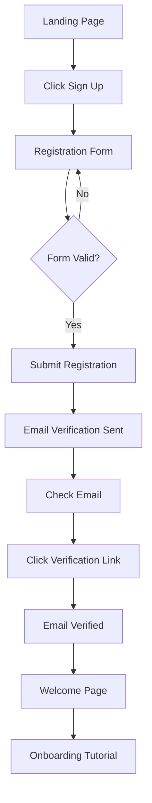

**Steps:**
1. User clicks "Sign Up" on landing page
2. Fills registration form (email, username, password, name)
3. Form validation (client-side and server-side)
4. Account created with unverified status
5. Verification email sent via SendGrid
6. User clicks verification link in email
7. Account status updated to verified
8. Welcome email sent
9. User redirected to onboarding

**Technical Implementation:**
- React Hook Form with Zod validation
- JWT token generation for session
- Email verification token with expiration
- Welcome email template with SendGrid

### 2. OAuth Login Flow (Google/GitHub)

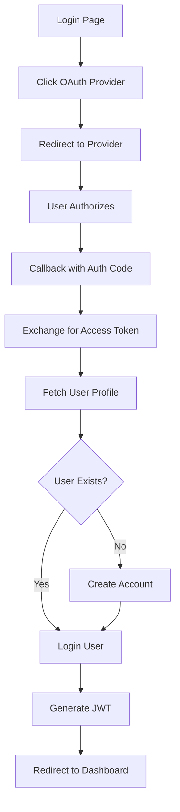

**Steps:**
1. User clicks "Continue with Google/GitHub"
2. Redirect to OAuth provider
3. User authorizes application
4. Callback with authorization code
5. Exchange code for access token
6. Fetch user profile from provider
7. Check if user exists in database
8. Create account if new user, login if existing
9. Generate JWT tokens
10. Redirect to appropriate page

### 3. Password Reset Flow

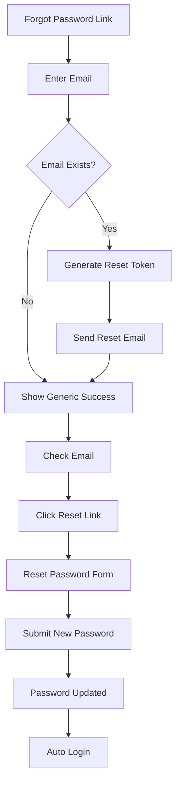

## Problem Solving Flows

### 1. Browse Problems Flow

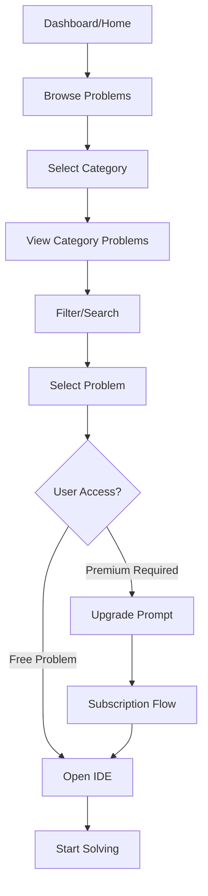

**Steps:**
1. User navigates to Problems section
2. Views available categories (Arrays, Trees, etc.)
3. Selects a category
4. Sees list of problems with difficulty indicators
5. Uses filters (difficulty, tags, status)
6. Clicks on a problem
7. Access check based on user tier
8. Either opens IDE or shows upgrade prompt

### 2. Problem Solving Flow

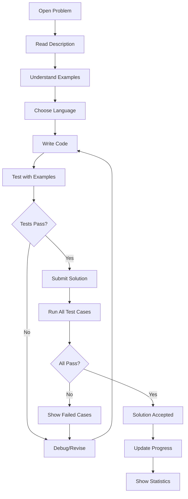

**Steps:**
1. Problem description loaded with examples
2. User selects programming language
3. Monaco editor initialized with template
4. User writes solution
5. Test with visible examples
6. Submit for full evaluation
7. Server runs against all test cases
8. Results displayed with performance metrics
9. Progress updated if successful

### 3. AI Assistance Flow

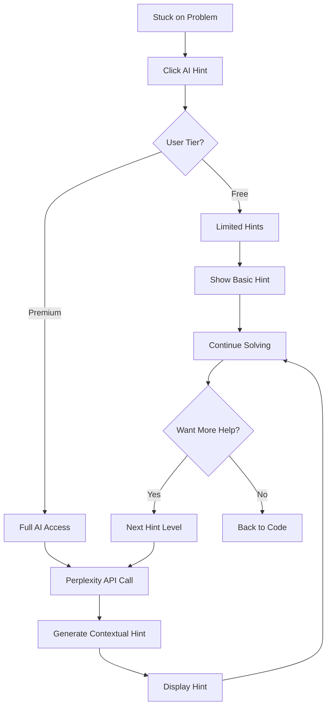

**Steps:**
1. User clicks "Get Hint" button
2. System checks user's subscription tier
3. For premium users, calls Perplexity API
4. AI generates hint based on problem context
5. Hint displayed without giving away solution
6. User can request progressive hints
7. Each hint level becomes more specific

## Admin Flows

### 1. Problem Creation Flow

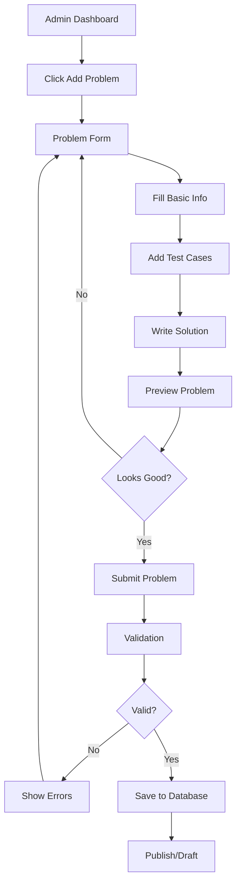

**Steps:**
1. Admin navigates to problem management
2. Clicks "Add New Problem"
3. Fills form: title, description, difficulty, category
4. Adds examples and constraints
5. Creates test cases (visible and hidden)
6. Writes reference solution
7. Previews how problem appears to users
8. Submits for validation
9. Server validates all fields and test cases
10. Problem saved and published

### 2. Bulk Import Flow

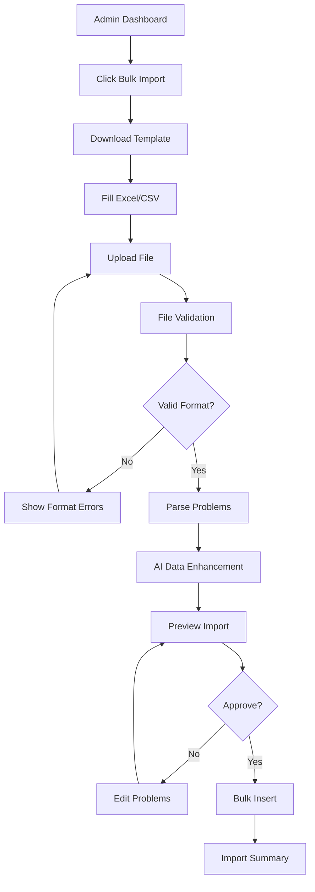

**Steps:**
1. Admin clicks "Bulk Import"
2. Downloads CSV template with required columns
3. Fills template with problem data
4. Uploads completed file
5. System validates file format and structure
6. Parses each row into problem objects
7. AI fills missing data (Perplexity API)
8. Shows preview of all problems to import
9. Admin reviews and approves
10. Bulk insert into database
11. Summary report with success/failure counts

### 3. User Management Flow

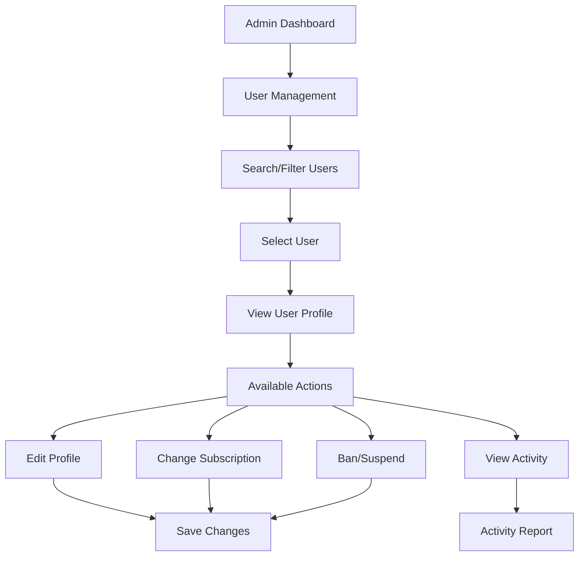

## Subscription Flows

### 1. Upgrade to Premium Flow

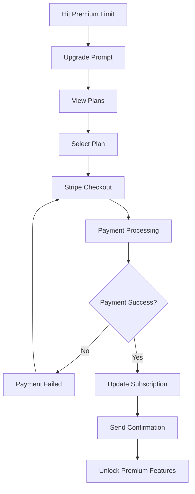

**Steps:**
1. User encounters premium problem or feature
2. Upgrade prompt displayed
3. User views available plans
4. Selects monthly or annual plan
5. Redirected to Stripe Checkout
6. Payment processed securely
7. Webhook confirms payment
8. User subscription upgraded in database
9. Confirmation email sent
10. Premium features unlocked

### 2. Subscription Management Flow

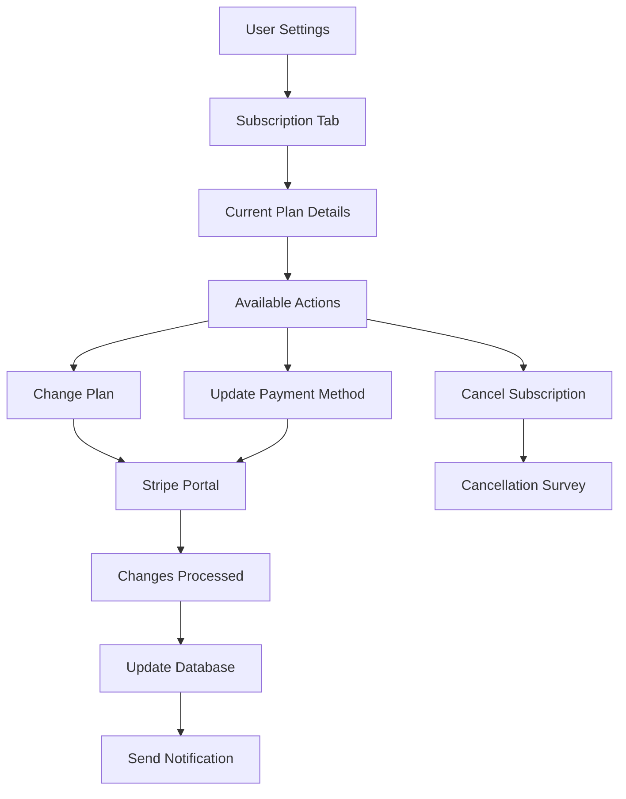

## Error Handling Flows

### 1. Network Error Flow

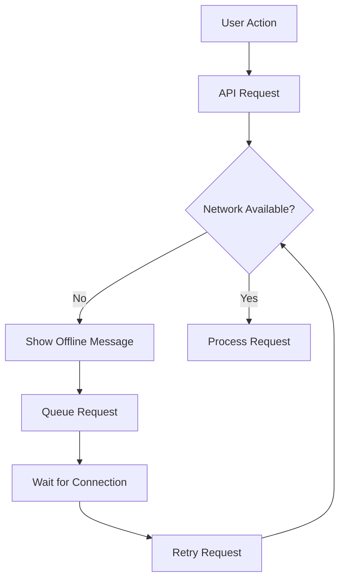

### 2. Authentication Error Flow

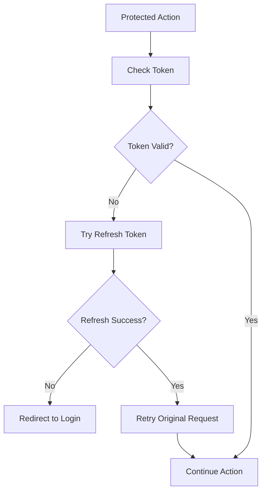

## Notification Flows

### 1. Email Notification Flow

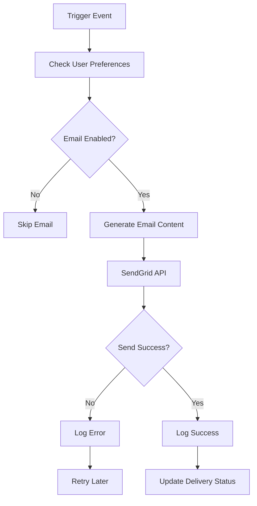

### 2. In-App Notification Flow

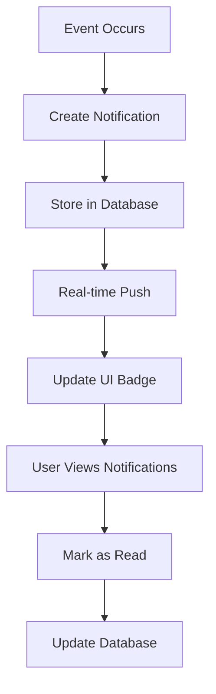

## Analytics Flows

### 1. User Progress Tracking

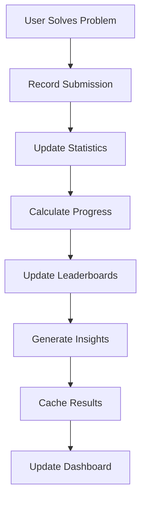

### 2. Admin Analytics Flow

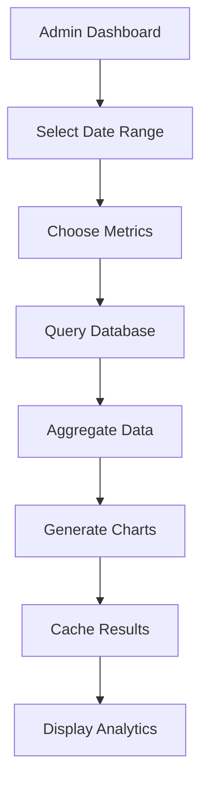

## Mobile Responsiveness

All flows are designed to work seamlessly across devices:

- **Desktop**: Full-featured experience with multi-panel layouts
- **Tablet**: Optimized layouts with collapsible sidebars
- **Mobile**: Touch-friendly interfaces with bottom navigation

## Performance Considerations

### 1. Loading States
- Skeleton screens during data fetching
- Progressive loading for large datasets
- Optimistic updates for better UX

### 2. Caching Strategy
- Redis caching for frequently accessed data
- Browser caching for static assets
- Service worker for offline functionality

### 3. Real-time Updates
- WebSocket connections for live updates
- Server-sent events for notifications
- Optimistic UI updates

This comprehensive user flow documentation ensures consistent and intuitive user experiences across all features of the DSAGrind platform.